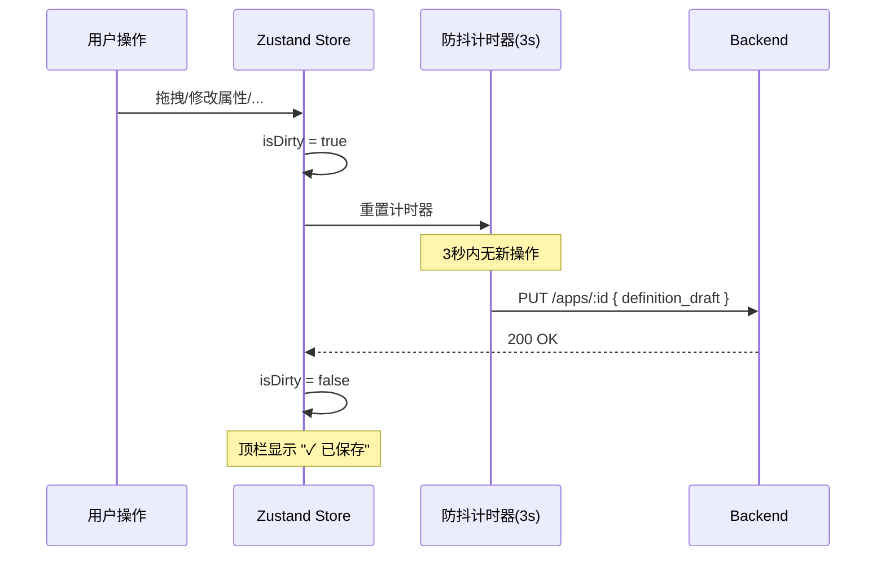
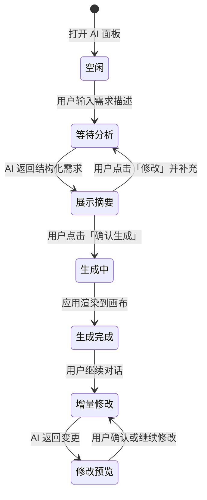
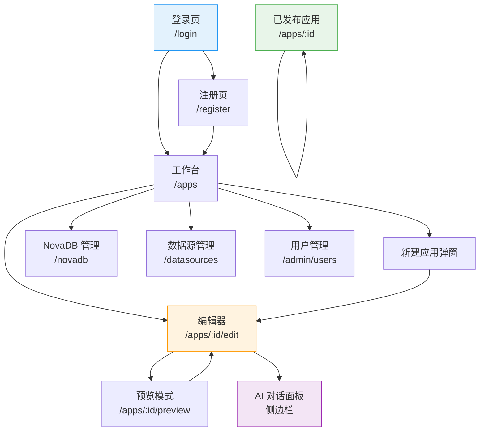
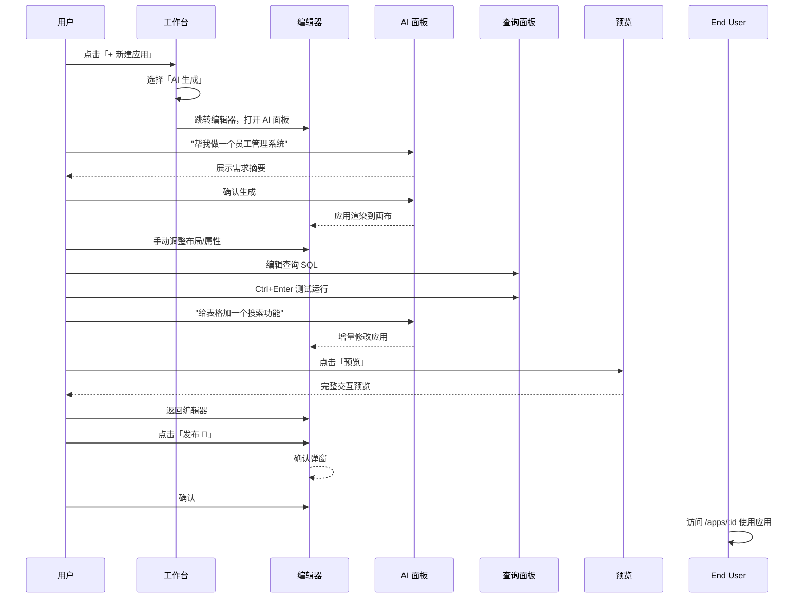

# NovaBuilder MVP 界面设计

创建者: HMJ
创建时间: 2026年3月5日 13:00
类别: 产品文档
上次编辑者: HMJ
上次更新时间: 2026年3月5日 13:06

<aside>
📋

**文档信息**

**产品名称：** NovaBuilder · AI 原生低代码应用开发平台 — **MVP 界面设计**

**版本：** MVP v0.1　|　**文档日期：** 2026-03-05　|　**状态：** 规划中

**文档作者：** HMJ

**用途：** 供 Claude Code 生成前端代码时参考的页面级设计规范

**关联文档：** [PRD_NovaBuilder_MVP](https://www.notion.so/PRD_NovaBuilder_MVP-79b61819ea784b2fb44d2487882c9efd?pvs=21)　|　[NovaBuilder MVP 技术架构](https://www.notion.so/NovaBuilder-MVP-fe6c951921554f16910dbc39aff353c3?pvs=21)　|　[NovaBuilder MVP 功能清单](https://www.notion.so/NovaBuilder-MVP-c522d31eb3b144d2b97fe844871855c3?pvs=21)

</aside>

---

# 〇、全局设计规范

## 0.1 设计系统

| **项目** | **规范** | **说明** |
| --- | --- | --- |
| UI 框架 | Ant Design 5 | 使用 antd 组件库，不自定义主题（MVP 阶段） |
| 主色调 | `#1677ff`（Ant Design 默认蓝） | 链接、主按钮、选中态 |
| 危险色 | `#ff4d4f` | 删除、错误 |
| 成功色 | `#52c41a` | 成功通知、已发布状态 |
| 字体 | 系统默认（-apple-system, BlinkMacSystemFont, 'Segoe UI'） | Ant Design 默认字体栈 |
| 圆角 | 6px（默认） | 按钮、卡片、输入框统一 |
| 间距基数 | 8px | 所有间距为 8 的倍数 |
| 布局宽度 | 100% 全宽 | MVP 仅桌面端，最小宽度 1280px |

## 0.2 全局布局模式

NovaBuilder 有两种布局模式：

### 模式 A：标准布局（工作台、NovaDB、数据源、管理后台）

```
┌─────────────────────────────────────────────────────────────────┐
│  🔷 NovaBuilder    应用    NovaDB    数据源    [Admin▾]  [HMJ▾] │  ← 顶部导航栏 (56px)
├─────────────────────────────────────────────────────────────────┤
│                                                                 │
│                     页面主体内容区                                │
│                   (max-width: 1200px, 居中)                      │
│                                                                 │
│                                                                 │
└─────────────────────────────────────────────────────────────────┘
```

### 模式 B：编辑器布局（应用编辑器）

```
┌─────────────────────────────────────────────────────────────────┐
│  ← 返回  │  应用名称  │  自动保存 ✓  │  [预览] [发布] │  [AI 🤖]  │  ← 编辑器顶栏 (48px)
├────┬────────────────────────────────────────┬───────────────────┤
│    │                                        │                   │
│ 左 │              画布区域                    │    右侧属性面板    │
│ 侧 │           (flex: 1)                     │    (320px 固定)    │
│ 面 │                                        │                   │
│ 板 │                                        │                   │
│    │                                        │                   │
│240 │                                        │                   │
│ px │                                        │                   │
│    ├────────────────────────────────────────┤                   │
│    │        底部查询面板 (可折叠, 280px)       │                   │
├────┴────────────────────────────────────────┴───────────────────┤
```

## 0.3 顶部导航栏组件

```
┌─────────────────────────────────────────────────────────────────┐
│  🔷 NovaBuilder    [应用]    [NovaDB]    [数据源]        [HMJ▾] │
└─────────────────────────────────────────────────────────────────┘
          Logo       Nav Tab   Nav Tab    Nav Tab      User Menu
```

| **元素** | **Ant Design 组件** | **说明** |
| --- | --- | --- |
| 容器 | `Layout.Header` | 高度 56px，背景 `#001529`（深色），固定顶部 |
| Logo | 自定义 `<div>` | 🔷 图标 + "NovaBuilder" 白色文字，点击回首页 |
| 导航菜单 | `Menu` mode="horizontal" theme="dark" | 菜单项：应用（/apps）、NovaDB（/novadb）、数据源（/datasources） |
| Admin 入口 | `Menu.Item` | 仅 role=admin 时显示，链接到 /admin/users |
| 用户菜单 | `Dropdown`  • `Avatar` | 头像 + 用户名下拉：个人信息、退出登录 |

## 0.4 全局状态与通知

| **场景** | **组件** | **行为** |
| --- | --- | --- |
| 操作成功 | `message.success()` | 顶部居中 toast，3s 后消失 |
| 操作失败 | `message.error()` | 顶部居中 toast，5s 后消失，显示错误信息 |
| 确认弹窗 | `Modal.confirm()` | 删除等危险操作前弹出确认 |
| 全局加载 | `Spin` | 页面切换时显示全屏 Loading |
| 403 无权限 | `Result` status="403" | 独立页面，提示无权访问 |
| 404 未找到 | `Result` status="404" | 独立页面，提供返回首页按钮 |

---

# 一、登录页（/login）

## 1.1 线框图

```
┌─────────────────────────────────────────────────────────────────┐
│                                                                 │
│                                                                 │
│                    ┌─────────────────────┐                      │
│                    │     🔷 NovaBuilder    │                      │
│                    │                     │                      │
│                    │  ┌───────────────┐  │                      │
│                    │  │ 📧 邮箱         │  │                      │
│                    │  └───────────────┘  │                      │
│                    │  ┌───────────────┐  │                      │
│                    │  │ 🔒 密码         │  │                      │
│                    │  └───────────────┘  │                      │
│                    │                     │                      │
│                    │  ┌───────────────┐  │                      │
│                    │  │    登 录       │  │                      │
│                    │  └───────────────┘  │                      │
│                    │                     │                      │
│                    │  还没有账号？立即注册  │                      │
│                    └─────────────────────┘                      │
│                                                                 │
│               背景: 浅灰渐变 (#f0f2f5)                           │
└─────────────────────────────────────────────────────────────────┘
```

## 1.2 组件规格

| **元素** | **Ant Design 组件** | **Props / 配置** |
| --- | --- | --- |
| 登录卡片 | `Card` | width: 400px, 居中, boxShadow, borderRadius: 8px |
| Logo | 自定义 | 🔷 图标 48px + "NovaBuilder" 标题 24px, 居中, marginBottom: 32px |
| 邮箱输入 | `Input` prefix={MailOutlined} | placeholder="请输入邮箱", size="large" |
| 密码输入 | `Input.Password` prefix={LockOutlined} | placeholder="请输入密码", size="large" |
| 登录按钮 | `Button` type="primary" htmlType="submit" | size="large", block=true, loading={isLoading} |
| 注册链接 | `Typography.Link` | 点击跳转 /register，居中显示 |
| 表单 | `Form` | layout="vertical", validateTrigger="onBlur" |

## 1.3 交互说明

| **交互** | **行为** |
| --- | --- |
| 点击登录 | ① 前端校验邮箱格式和密码非空 → ② 按钮显示 loading → ③ 调用 `POST /api/v1/auth/login` → ④ 成功：存储 token 到 localStorage，跳转 /apps → ⑤ 失败：`message.error('邮箱或密码错误')` |
| Token 刷新 | Axios 拦截器：401 时自动用 refreshToken 调用 `POST /api/v1/auth/refresh`，成功则重试原请求，失败则跳转登录页 |
| 已登录访问 | 路由守卫检测 token 存在且有效，自动跳转 /apps |
| Enter 键 | 在密码框按 Enter 等同点击登录 |

## 1.4 API 映射

| **操作** | **API** | **Request** | **Response** |
| --- | --- | --- | --- |
| 登录 | `POST /api/v1/auth/login` | `{ email, password }` | `{ accessToken, refreshToken, user: { id, name, email, role } }` |

---

# 二、注册页（/register）

## 2.1 线框图

```
┌─────────────────────────────────────────────────────────────────┐
│                    ┌─────────────────────┐                      │
│                    │     🔷 NovaBuilder    │                      │
│                    │     创建你的账号      │                      │
│                    │                     │                      │
│                    │  ┌───────────────┐  │                      │
│                    │  │ 👤 用户名       │  │                      │
│                    │  └───────────────┘  │                      │
│                    │  ┌───────────────┐  │                      │
│                    │  │ 📧 邮箱         │  │                      │
│                    │  └───────────────┘  │                      │
│                    │  ┌───────────────┐  │                      │
│                    │  │ 🔒 密码         │  │ 密码强度条           │
│                    │  └───────────────┘  │                      │
│                    │  ┌───────────────┐  │                      │
│                    │  │ 🔒 确认密码     │  │                      │
│                    │  └───────────────┘  │                      │
│                    │                     │                      │
│                    │  ┌───────────────┐  │                      │
│                    │  │    注 册       │  │                      │
│                    │  └───────────────┘  │                      │
│                    │                     │                      │
│                    │  已有账号？立即登录    │                      │
│                    └─────────────────────┘                      │
└─────────────────────────────────────────────────────────────────┘
```

## 2.2 表单校验规则

| **字段** | **校验规则** | **错误提示** |
| --- | --- | --- |
| 用户名 | 必填, 2-50 字符 | "请输入用户名" / "用户名长度为 2-50 个字符" |
| 邮箱 | 必填, 合法邮箱格式, 唯一 | "请输入邮箱" / "邮箱格式不正确" / "该邮箱已注册" |
| 密码 | 必填, ≥8 位, 包含大写+小写+数字 | "密码至少 8 位，需包含大小写字母和数字" |
| 确认密码 | 必填, 与密码一致 | "两次输入的密码不一致" |

---

# 三、工作台 — 应用列表（/apps）

## 3.1 线框图

```
┌─────────────────────────────────────────────────────────────────┐
│  🔷 NovaBuilder    [应用]    [NovaDB]    [数据源]        [HMJ▾] │
├─────────────────────────────────────────────────────────────────┤
│                                                                 │
│  我的应用                                    [🔍 搜索]  [+ 新建应用] │
│                                                                 │
│  排序: [最近更新▾]                                                │
│                                                                 │
│  ┌──────────────┐  ┌──────────────┐  ┌──────────────┐          │
│  │  ✨ AI 生成    │  │              │  │              │          │
│  │              │  │  员工管理系统  │  │  订单仪表板   │          │
│  │  用 AI 创建   │  │              │  │              │          │
│  │  你的第一个   │  │  🟢 已发布     │  │  📝 草稿      │          │
│  │  应用         │  │              │  │              │          │
│  │              │  │  更新于 10分前  │  │  更新于 1小时前│          │
│  │  [开始创建]   │  │  [编辑] [···] │  │  [编辑] [···] │          │
│  └──────────────┘  └──────────────┘  └──────────────┘          │
│                                                                 │
│  ┌──────────────┐  ┌──────────────┐                            │
│  │              │  │              │                            │
│  │  库存管理     │  │   CRM 客户    │                            │
│  │              │  │              │                            │
│  │  🟢 已发布     │  │  📝 草稿      │                            │
│  │              │  │              │                            │
│  │  更新于 昨天   │  │  更新于 3天前  │                            │
│  │  [编辑] [···] │  │  [编辑] [···] │                            │
│  └──────────────┘  └──────────────┘                            │
│                                                                 │
└─────────────────────────────────────────────────────────────────┘
```

## 3.2 组件规格

| **区域** | **Ant Design 组件** | **Props / 配置** |
| --- | --- | --- |
| 页面标题 | `Typography.Title` level={3} | "我的应用" |
| 搜索框 | `Input.Search` | placeholder="搜索应用...", allowClear, style: { width: 240 } |
| 新建按钮 | `Button` type="primary" icon={PlusOutlined} | "新建应用"，点击弹出创建方式选择 |
| 排序选择 | `Select` | options: 最近更新 / 最近创建 / 名称排序 |
| 应用卡片容器 | `Row`  • `Col` | gutter: [24, 24], Col span={6}（一行 4 个） |
| AI 生成卡片 | `Card` hoverable | 虚线边框，渐变背景（蓝紫），固定为第一张卡片 |
| 应用卡片 | `Card` hoverable | height: 200px, 包含：应用名称（Title）、状态标签（Tag）、更新时间（相对时间）、操作按钮 |
| 状态标签 | `Tag` | 已发布: color="success" 🟢 / 草稿: color="default" 📝 |
| 操作菜单 | `Dropdown`  • `Button` icon={MoreOutlined} | 菜单项：打开、复制、重命名、删除（红色） |
| 空状态 | `Empty` | 无应用时显示："还没有应用，点击上方按钮开始创建" |

## 3.3 新建应用弹窗

```
┌──────────────────────────────────────┐
│  创建新应用                     [✕]  │
├──────────────────────────────────────┤
│                                      │
│  选择创建方式：                       │
│                                      │
│  ┌──────────────┐ ┌──────────────┐  │
│  │  📝           │ │  🤖           │  │
│  │  空白应用      │ │  AI 生成      │  │
│  │              │ │              │  │
│  │  从零开始搭建  │ │  描述你的需求  │  │
│  │  应用         │ │  AI 帮你生成  │  │
│  └──────────────┘ └──────────────┘  │
│                                      │
│  应用名称：                           │
│  ┌──────────────────────────────┐   │
│  │ 未命名应用                    │   │
│  └──────────────────────────────┘   │
│                                      │
│              [取消]  [创建]          │
└──────────────────────────────────────┘
```

| **组件** | **Ant Design** | **说明** |
| --- | --- | --- |
| 弹窗 | `Modal` | width: 520px, centered |
| 创建方式 | 两个 `Card` hoverable | 选中态加蓝色边框，默认选中「空白应用」 |
| 应用名称 | `Input` | 默认值 "未命名应用", maxLength: 200 |

### 交互流程

1. 选择「空白应用」→ 点击创建 → `POST /api/v1/apps` → 跳转到 `/apps/:id/edit`
2. 选择「AI 生成」→ 点击创建 → `POST /api/v1/apps` → 跳转到 `/apps/:id/edit` 并自动打开 AI 面板

## 3.4 API 映射

| **操作** | **API** | **说明** |
| --- | --- | --- |
| 加载列表 | `GET /api/v1/apps` | 返回 `App[]`，按 updatedAt DESC |
| 创建应用 | `POST /api/v1/apps` | `{ name }` → 返回新应用 |
| 删除应用 | `DELETE /api/v1/apps/:id` | 需 Admin 角色，二次确认 |
| 重命名 | `PUT /api/v1/apps/:id` | `{ name }` |
| 复制 | `POST /api/v1/apps/:id/clone` | 服务端克隆 definition |

---

# 四、应用编辑器（/apps/:id/edit）— 核心页面

<aside>
⭐

**这是 NovaBuilder 最核心、最复杂的页面。** 包含左侧面板、中间画布、右侧属性面板、底部查询面板、AI 对话面板 五大区域。

</aside>

## 4.1 整体布局线框图

```
┌─────────────────────────────────────────────────────────────────────────┐
│ ← 返回 │ 📱 员工管理系统 │ ✓ 已保存 │ Page1 ▾ │ [预览👁] [发布🚀] │ [🤖 AI] │  ← 顶栏 48px
├────────┬───────────────────────────────────────────┬────────────────────┤
│        │                                           │                    │
│  左侧   │                                           │   右侧属性面板       │
│  面板   │                                           │   (320px)          │
│ (240px) │              画 布 区 域                    │                    │
│        │           (自由布局 Canvas)                  │   ┌──────────────┐│
│ [组件]  │                                           │   │ 属性          ││
│ [页面]  │   ┌─────────────────────────────┐         │   │ ─────────── ││
│ [组件树]│   │  Table: userTable            │         │   │ 数据绑定      ││
│ [查询]  │   │  ┌──┬──────┬──────┬──────┐  │         │   │ queries.get  ││
│        │   │  │ID│ 姓名  │ 邮箱  │ 角色  │  │         │   │ Users.data   ││
│ ──────  │   │  ├──┼──────┼──────┼──────┤  │         │   │              ││
│ 📊 数据  │   │  │1 │ 张三  │ z@x  │ 管理  │  │         │   │ 列配置        ││
│  Table  │   │  │2 │ 李四  │ l@x  │ 编辑  │  │         │   │  ID: number  ││
│  List   │   │  └──┴──────┴──────┴──────┘  │         │   │  姓名: text  ││
│  Chart  │   └─────────────────────────────┘         │   │  邮箱: text  ││
│  Stat   │                                           │   │              ││
│ 📝 表单  │         ┌────────┐                        │   │ 事件          ││
│  Input  │         │ + 新增  │                        │   │ onRowClick:  ││
│  Number │         └────────┘                        │   │  → openModal ││
│  Select │                                           │   └──────────────┘│
│  Date   │                                           │                    │
│  ...    │                                           │                    │
│        ├───────────────────────────────────────────┤                    │
│        │ 查询面板 ▴                        [+ 新建]  │                    │
│        │ ┌──────┐ ┌──────────────────────────────┐ │                    │
│        │ │getAll│ │ SELECT * FROM employees       │ │                    │
│        │ │ Users│ │ WHERE role = input1.value │ │                    │
│        │ │      │ │                              │ │                    │
│        │ │create│ │ [▶ 运行]  耗时: 45ms  行数: 28 │ │                    │
│        │ │ User │ │ ┌──┬──────┬──────┬──────┐   │ │                    │
│        │ │      │ │ │ID│ name │ email│ role  │   │ │                    │
│        │ │delete│ │ │1 │张三  │z@x   │admin  │   │ │                    │
│        │ │ User │ │ └──┴──────┴──────┴──────┘   │ │                    │
│        │ └──────┘ └──────────────────────────────┘ │                    │
├────────┴───────────────────────────────────────────┴────────────────────┤
```

## 4.2 编辑器顶栏

```
┌────────────────────────────────────────────────────────────────────┐
│ [← 返回]  📱 员工管理系统 ✏️  │ ✓ 已保存 │ [↶][↷] │ [👁预览] [🚀发布] │ [🤖AI] │
└────────────────────────────────────────────────────────────────────┘
```

| **元素** | **组件** | **说明** |
| --- | --- | --- |
| 返回按钮 | `Button` type="text" icon={ArrowLeftOutlined} | 返回 /apps 列表 |
| 应用名称 | 可编辑 `Typography.Title` level={5} | 点击进入编辑状态，失焦保存 |
| 保存状态 | `Typography.Text` type="secondary" | "✓ 已保存" / "● 保存中..." / "⚠ 保存失败" |
| 撤销/重做 | 两个 `Button` type="text" | icon={UndoOutlined}/{RedoOutlined}, disabled 根据 history 状态 |
| 预览按钮 | `Button` icon={EyeOutlined} | 切换到预览模式 |
| 发布按钮 | `Button` type="primary" icon={SendOutlined} | 弹出发布确认框 |
| AI 按钮 | `Button` icon={RobotOutlined} | 切换右侧面板为 AI 对话面板 |

## 4.3 左侧面板（240px）

左侧面板有 **4 个 Tab 页签**：

### Tab 1：组件面板

```
┌────────────────────┐
│ [组件] [页面] [树] [Q]│  ← Tabs
├────────────────────┤
│ 🔍 搜索组件...       │
├────────────────────┤
│ 📊 数据展示          │
│  [Table] [List]    │
│  [Chart] [Stat]    │
├────────────────────┤
│ 📝 表单输入          │
│  [TextInput]       │
│  [NumberInput]     │
│  [Select]          │
│  [DatePicker]      │
│  [FileUpload]      │
│  [RichText]        │
├────────────────────┤
│ 📐 布局容器          │
│  [Container]       │
│  [Tabs] [Modal]    │
├────────────────────┤
│ 🎯 操作反馈          │
│  [Button] [Toggle] │
│  [Checkbox]        │
│  [Spinner]         │
├────────────────────┤
│ 🖼️ 媒体展示          │
│  [Image]           │
│  [PDFViewer]       │
├────────────────────┤
│ 🧭 导航              │
│  [Sidebar]         │
└────────────────────┘
```

| **元素** | **组件** | **交互** |
| --- | --- | --- |
| Tab 切换 | `Tabs` size="small" tabPosition="top" | 组件 / 页面 / 组件树 / 查询，4 个 tab |
| 搜索框 | `Input.Search` size="small" | 实时过滤组件列表 |
| 分类标题 | `Typography.Text` type="secondary" | 折叠组 header |
| 组件项 | 自定义 `div`  • `@dnd-kit` draggable | 48x48 卡片，图标 + 名称，**可拖拽到画布** |

### Tab 2：页面管理

```
┌────────────────────┐
│ [组件] [页面] [树] [Q]│
├────────────────────┤
│ 页面列表     [+ 新建]│
├────────────────────┤
│ 📄 首页        ●    │  ← 当前页高亮
│ 📄 用户详情         │
│ 📄 设置页           │
│                    │
│                    │
│ (拖拽排序)          │
└────────────────────┘
```

| **操作** | **行为** |
| --- | --- |
| 点击页面项 | 切换画布到该页面 |
| 双击页面项 | 进入重命名编辑 |
| 右键菜单 | 重命名 / 复制 / 设为首页 / 删除（至少保留 1 页） |
| 拖拽排序 | @dnd-kit sortable 实现页面顺序调整 |
| 新建页面 | 上限 10 页，超出时按钮 disabled + tooltip "最多 10 个页面" |

### Tab 3：组件树

```
┌────────────────────┐
│ [组件] [页面] [树] [Q]│
├────────────────────┤
│ 📄 首页              │
│  ├─ 🧭 sidebar1     │
│  ├─ 📊 userTable    │  ← 选中态蓝色背景
│  ├─ 🎯 addButton    │
│  └─ 📐 container1   │
│     ├─ 📝 nameInput │
│     └─ 📝 emailInput│
└────────────────────┘
```

- 使用 `Tree` 组件展示当前页面的组件层级
- 点击节点 = 选中对应组件（画布同步高亮）
- 拖拽节点可调整层级关系（父子嵌套）

### Tab 4：查询列表

```
┌────────────────────┐
│ [组件] [页面] [树] [Q]│
├────────────────────┤
│ 查询列表     [+ 新建]│
├────────────────────┤
│ 🔍 getAllUsers  SQL │
│ ➕ createUser   SQL │
│ 🔄 updateUser   SQL │
│ ❌ deleteUser   SQL │
│ 📊 getStats     JS  │
└────────────────────┘
```

- 点击查询项 → 底部查询面板切换到该查询
- 右键：重命名 / 复制 / 删除
- 新建时选择查询类型：SQL / JavaScript / 可视化 / REST API

## 4.4 中间画布区域

| **功能** | **实现方案** | **说明** |
| --- | --- | --- |
| 布局模式 | 自由布局（absolute positioning） | 组件通过 x, y, width, height 定位 |
| 拖拽引擎 | `@dnd-kit` DndContext | 处理从侧边栏拖入 + 画布内移动 |
| 网格吸附 | gridSize: 8px | 拖拽和调整大小时自动对齐到网格 |
| 辅助线 | 自定义渲染层 | 拖拽时显示与其他组件的对齐线（水平/垂直居中、边缘对齐） |
| 选中态 | 蓝色虚线边框 + 8 个调整手柄 | 选中组件显示：左上角组件名标签、四角 + 四边中点调整手柄 |
| 多选 | Shift+Click 或 框选 | 多选时显示整体外框，可批量移动 |
| 右键菜单 | `Dropdown` trigger="contextMenu" | 复制 / 粘贴 / 删除 / 置顶 / 置底 / 上移 / 下移 |
| 缩放 | Ctrl + 滚轮 | 50% ~ 200%，画布左下角显示缩放百分比 |
| 平移 | 空格 + 拖拽 或 中键拖拽 | 画布可平移查看超出视口的区域 |
| 快捷键 | 全局监听 | Ctrl+Z 撤销, Ctrl+Shift+Z 重做, Ctrl+C/V 复制粘贴, Delete 删除, Ctrl+S 保存 |

### 画布组件选中态样式

```
选中前:                        选中后:
┌──────────────────┐          ┌─ userTable ────────────────┐
│  Table Content   │          │╔══════════════════════════╗│
│                  │    →     │║  Table Content           ║│
│                  │          │║                          ║│
└──────────────────┘          │╚══════════════════════════╝│
                              ◇──────────────◇─────────────◇
                              ↑ 调整手柄 (resize handles)
```

## 4.5 右侧属性面板（320px）

选中组件后，右侧面板显示该组件的配置。以 **Table 组件** 为例：

```
┌──────────────────────────┐
│ 📊 Table: userTable  [✕]  │  ← 组件类型 + 名称 + 取消选中
├──────────────────────────┤
│ [属性]  [样式]  [事件]     │  ← 三个 Tab
├──────────────────────────┤
│ 数据                      │
│ ┌──────────────────────┐ │
│ │queries.getAll.data│ │  ← 绑定表达式输入框
│ └──────────────────────┘ │
│                          │
│ 列配置                    │
│ ┌──────────────────────┐ │
│ │ ✏️ ID    │ number │ [✕] │ │
│ │ ✏️ 姓名  │ text   │ [✕] │ │
│ │ ✏️ 邮箱  │ text   │ [✕] │ │
│ │ ✏️ 角色  │ select │ [✕] │ │
│ │              [+ 添加列] │ │
│ └──────────────────────┘ │
│                          │
│ 分页                      │
│ ☑ 启用分页   每页: [10 ▾]  │
│                          │
│ 搜索                      │
│ ☑ 显示搜索框              │
│                          │
│ 行选择                    │
│ ○ 无  ● 单选  ○ 多选      │
│                          │
│ 服务端分页                 │
│ ☐ 启用                    │
│                          │
│ 加载状态                   │
│ ┌──────────────────────┐ │
│ │queries.getAll       │ │
│ │      .isLoading     │ │
│ └──────────────────────┘ │
└──────────────────────────┘
```

### 属性面板通用结构

每个组件的属性面板由 `propertySchema` 动态生成，支持以下属性类型渲染器：

| **属性类型** | **渲染组件** | **示例** |
| --- | --- | --- |
| text | `Input` 或 `Input.TextArea` | 标题、占位符 |
| number | `InputNumber` | 宽度、高度、分页数 |
| boolean | `Switch` | 是否显示搜索框、是否禁用 |
| select | `Select` | 按钮类型、图表类型 |
| color | `ColorPicker` | 背景色、文字颜色 |
| expression | 自定义编辑器（带 `{{}}` 标记） | 数据绑定、条件可见性 |
| event | 事件配置面板 | onClick → 动作列表 |
| columns | 列配置列表 | Table 的列定义 |

### 样式 Tab

```
┌──────────────────────────┐
│ [属性]  [样式]  [事件]     │
├──────────────────────────┤
│ 布局                      │
│ X: [120]  Y: [80]        │
│ W: [600]  H: [400]       │
│                          │
│ 外观                      │
│ 背景色: [🟦 #ffffff ▾]    │
│ 边框: [1px] [solid] [#d9]│
│ 圆角: [6  ] px            │
│ 阴影: [无▾]               │
│                          │
│ 可见性                    │
│ ┌──────────────────────┐ │
│ │currentUser.role     │ │
│ │  === 'admin'        │ │
│ └──────────────────────┘ │
└──────────────────────────┘
```

### 事件 Tab

```
┌──────────────────────────┐
│ [属性]  [样式]  [事件]     │
├──────────────────────────┤
│ onRowClick               │
│ ┌──────────────────────┐ │
│ │ 动作 1: 设置组件值     │ │
│ │   组件: detailModal   │ │
│ │   值: true (打开)     │ │
│ │                [✕]   │ │
│ ├──────────────────────┤ │
│ │ 动作 2: 执行查询      │ │
│ │   查询: getUserDetail │ │
│ │                [✕]   │ │
│ └──────────────────────┘ │
│         [+ 添加动作]      │
│                          │
│ ──────────────────────── │
│ onClick (无动作)    [+ 添加]│
│ onChange (无动作)   [+ 添加]│
└──────────────────────────┘
```

### 添加动作弹窗

```
┌─────────────────────────────┐
│  选择动作类型           [✕]  │
├─────────────────────────────┤
│                             │
│  ▶ 执行查询   选择查询并运行  │
│  📝 设置组件值  修改组件属性  │
│  🧭 导航页面   跳转应用页面   │
│  💬 显示通知   弹出提示消息   │
│  📦 打开模态框  显示 Modal   │
│  📦 关闭模态框  隐藏 Modal   │
│  📋 复制到剪贴板             │
│  🔗 打开 URL                │
│                             │
└─────────────────────────────┘
```

## 4.6 底部查询面板（可折叠，280px）

```
┌────────────────────────────────────────────────────────────────┐
│ 查询面板 ▴▾                                          [+ 新建]  │  ← 标题栏，点击折叠/展开
├───────┬────────────────────────────────────────────────────────┤
│       │ getAllUsers  ×     ┌─[SQL]──[JS]──[可视化]──[REST]─┐   │
│ 查询   │                   │                               │   │
│ 列表   │ 数据源: [NovaDB▾]  │ SELECT *                      │   │
│       │                   │ FROM employees                │   │
│ ┌───┐ │ ┌──────────────┐  │ WHERE department =           │   │
│ │get│ │ │ 设置          │  │   components.deptSelect.value  │   │
│ │All│ │ │              │  │                              │   │
│ │   │ │ │ 触发: ☑ 页面   │  │ ORDER BY created_at DESC      │   │
│ ├───┤ │ │   加载时运行   │  │ LIMIT 50                      │   │
│ │cre│ │ │              │  │                               │   │
│ │ate│ │ │ 超时: [10]秒   │  └───────────────────────────────┘   │
│ │   │ │ │              │                                      │
│ ├───┤ │ │ 成功回调:     │  [▶ 运行]  [💾 保存]                   │
│ │del│ │ │  刷新表格     │                                      │
│ │ete│ │ │              │  ── 结果 ─────── 耗时: 45ms  行: 28 ─ │
│ │   │ │ │ 确认执行: ☐   │  │ [JSON] [表格] │                    │
│ └───┘ │ └──────────────┘  │ ID │ name  │ email  │ dept   │    │
│       │                   │ 1  │ 张三  │ z@x.c  │ 技术   │    │
│ [+新建]│                   │ 2  │ 李四  │ l@x.c  │ 产品   │    │
└───────┴────────────────────────────────────────────────────────┘
```

| **区域** | **组件** | **说明** |
| --- | --- | --- |
| 查询列表 | `Menu` mode="vertical" | 左侧 120px，显示所有查询，选中高亮 |
| 查询类型切换 | `Tabs` | SQL / JavaScript / 可视化 / REST API |
| 数据源选择 | `Select` | 从已配置数据源列表选择 |
| SQL 编辑器 | `CodeMirror 6` | SQL 语法高亮, `{{}}` 变量高亮, 行号 |
| JS 编辑器 | `CodeMirror 6` | JavaScript 语法高亮 |
| 运行按钮 | `Button` type="primary" | 快捷键 Ctrl+Enter |
| 结果展示 | `Tabs`  • `Table` / `pre` | 表格视图（antd Table）和 JSON 视图（格式化 JSON）切换 |
| 设置面板 | 右侧折叠区 | 触发方式、超时、回调配置 |
| AI SQL 生成 | `Button` icon={RobotOutlined} | SQL 编辑器右上角，点击弹出输入框描述需求 |

### 可视化查询模式

```
┌──────────────────────────────────────────────┐
│ 操作: [读取▾]   表: [employees▾]              │
│                                              │
│ 筛选条件:                                     │
│ ┌──────────┬─────┬──────────┬───┐           │
│ │department│  =  │dept.v│[✕]│  [+ 添加]  │
│ └──────────┴─────┴──────────┴───┘           │
│                                              │
│ 排序: [created_at▾] [降序▾]                    │
│                                              │
│ 分页: 每页 [50] 条   偏移 [0]                  │
│                                              │
│ 选择列: ☑ 全部  □ id  □ name  □ email        │
└──────────────────────────────────────────────┘
```

### REST API 查询模式

```
┌──────────────────────────────────────────────┐
│ 方法: [GET▾]   路径: [/users/id.value]    │
│                                              │
│ Headers:                                     │
│ ┌──────────┬───────────────┬───┐            │
│ │Content-  │application/   │[✕]│  [+ 添加]   │
│ │Type      │json           │   │            │
│ └──────────┴───────────────┴───┘            │
│                                              │
│ Query Params:                                │
│ ┌──────────┬───────────────┬───┐            │
│ │page      │1              │[✕]│  [+ 添加]   │
│ └──────────┴───────────────┴───┘            │
│                                              │
│ Body (JSON):                                 │
│ ┌──────────────────────────────┐            │
│ │{                             │            │
│ │  "name": input.value     │            │
│ │}                             │            │
│ └──────────────────────────────┘            │
└──────────────────────────────────────────────┘
```

## 4.7 自动保存机制



---

# 五、AI 对话面板

<aside>
🤖

AI 面板是编辑器右侧的**侧边抽屉**，点击顶栏 AI 按钮切换显示。当 AI 面板打开时，属性面板被替换为 AI 面板。

</aside>

## 5.1 线框图

```
┌──────────────────────────┐
│ 🤖 AI 助手          [✕]  │
├──────────────────────────┤
│                          │
│  ┌──────────────────┐   │
│  │ 🤖 你好！我是 Nova  │   │
│  │ AI 助手。描述你想   │   │
│  │ 创建的应用，我来帮  │   │
│  │ 你生成。           │   │
│  └──────────────────┘   │
│                          │
│        ┌──────────────┐ │
│        │ 帮我做一个员工 │ │  ← 用户消息
│        │ 管理系统，包含 │ │
│        │ 员工列表和详情 │ │
│        └──────────────┘ │
│                          │
│  ┌──────────────────┐   │
│  │ 🤖 好的，我分析了  │   │  ← AI 回复
│  │ 你的需求：        │   │
│  │                  │   │
│  │ 📋 需求摘要       │   │
│  │ ┌──────────────┐ │   │
│  │ │ 页面：2 个     │ │   │
│  │ │ • 员工列表页   │ │   │
│  │ │ • 员工详情页   │ │   │
│  │ │              │ │   │
│  │ │ 组件：5 个    │ │   │
│  │ │ • 表格       │ │   │
│  │ │ • 搜索框     │ │   │
│  │ │ • 新增按钮   │ │   │
│  │ │ • 详情表单   │ │   │
│  │ │ • 模态框     │ │   │
│  │ │              │ │   │
│  │ │ 数据模型：    │ │   │
│  │ │ employees 表  │ │   │
│  │ │ • id (自增)   │ │   │
│  │ │ • name (文本) │ │   │
│  │ │ • email (文本)│ │   │
│  │ │ • dept (文本) │ │   │
│  │ └──────────────┘ │   │
│  │                  │   │
│  │ [✅ 确认生成]      │   │
│  │ [✏️ 我要修改]      │   │
│  └──────────────────┘   │
│                          │
│ ● 正在生成应用...         │  ← 生成中进度
│ ████████░░░░ 60%         │
│                          │
├──────────────────────────┤
│ ┌────────────────┐ [发送] │
│ │ 输入你的需求...  │       │  ← 输入框
│ └────────────────┘       │
└──────────────────────────┘
```

## 5.2 组件规格

| **元素** | **组件** | **说明** |
| --- | --- | --- |
| 面板容器 | 自定义侧边栏, 320px | 替换属性面板位置，可通过 AI 按钮切换 |
| 消息列表 | 自定义 `div` 列表 | 滚动容器，新消息自动滚动到底部 |
| 用户消息 | 右对齐气泡, 蓝色背景 | borderRadius: 12px, maxWidth: 85% |
| AI 消息 | 左对齐气泡, 灰色背景 | 带 🤖 头像, Markdown 渲染 |
| 需求摘要卡片 | `Card` 嵌套在 AI 消息内 | 分三块：页面列表、组件列表、数据模型 |
| 确认按钮 | `Button` type="primary" | "确认生成"，点击后开始生成应用 |
| 修改按钮 | `Button` | "我要修改"，展开输入框补充需求 |
| 生成进度 | `Progress` | percent 动态更新, status="active" |
| 输入框 | `Input.TextArea` autoSize | Enter 发送, Shift+Enter 换行, maxRows: 4 |
| 发送按钮 | `Button` type="primary" icon={SendOutlined} | 输入为空时 disabled |

## 5.3 交互流程



## 5.4 API 映射

| **阶段** | **API** | **Request** | **Response** |
| --- | --- | --- | --- |
| 需求分析 | `POST /api/v1/ai/analyze` | `{ input, appId? }` | `{ pages[], components[], dataModel, summary }` |
| 应用生成 | `POST /api/v1/ai/generate` | `{ requirement, appId }` | `{ appDefinition }` (SSE 流式) |
| 增量修改 | `POST /api/v1/ai/modify` | `{ appId, instruction, history[] }` | `{ patch, changedComponents[] }` |
| SQL 生成 | `POST /api/v1/ai/generate-sql` | `{ description, dataSourceId }` | `{ sql, explanation }` |

---

# 六、应用预览与运行（/apps/:id/preview & /apps/:id）

## 6.1 预览模式（Builder 视角）

从编辑器点击「预览」进入，顶部保留一个浮动工具条：

```
┌─────────────────────────────────────────────────────────────────┐
│            👁 预览模式              [返回编辑器]  [在新标签打开]   │
├─────────────────────────────────────────────────────────────────┤
│                                                                 │
│  ┌─────┐                                                       │
│  │ 📋   │  ┌───────────────────────────────────────┐           │
│  │ 员工  │  │                                       │           │
│  │ 列表  │  │   员工管理系统                          │           │
│  │     │  │                                       │           │
│  │ 📋   │  │   [🔍 搜索...]              [+ 新增员工] │           │
│  │ 设置  │  │                                       │           │
│  │     │  │   ┌──┬──────┬──────┬──────┬──────┐   │           │
│  │     │  │   │ID│ 姓名  │ 邮箱  │ 部门  │ 操作  │   │           │
│  │     │  │   ├──┼──────┼──────┼──────┼──────┤   │           │
│  │     │  │   │1 │ 张三  │ z@x  │ 技术  │ [编辑]│   │           │
│  │     │  │   │2 │ 李四  │ l@x  │ 产品  │ [编辑]│   │           │
│  │     │  │   │3 │ 王五  │ w@x  │ 设计  │ [编辑]│   │           │
│  │     │  │   └──┴──────┴──────┴──────┴──────┘   │           │
│  │     │  │                                       │           │
│  │     │  │   << 1 2 3 ... 5 >>                   │           │
│  └─────┘  └───────────────────────────────────────┘           │
│                                                                 │
└─────────────────────────────────────────────────────────────────┘
```

## 6.2 End User 运行模式（/apps/:id）

- 无编辑器 UI，只有应用本身
- 调用 `GET /api/v1/apps/:id/published` 获取发布版 definition
- 使用 `PageRenderer` 渲染组件树
- 自动执行 trigger=pageLoad 的查询
- 用户交互触发事件 → 执行动作链

---

# 七、NovaDB 管理页面（/novadb）

## 7.1 线框图

```
┌─────────────────────────────────────────────────────────────────┐
│  🔷 NovaBuilder    [应用]    [NovaDB]    [数据源]        [HMJ▾] │
├────────┬────────────────────────────────────────────────────────┤
│        │                                                        │
│ 数据表  │  📊 employees                       [+ 添加列] [SQL ▾] │
│ 列表   │                                                        │
│        │  ┌──────────────────────────────────────────────┐      │
│ ┌────┐ │  │ 🔍 搜索...                                    │      │
│ │empl│ │  ├──┬───────┬──────────┬───────┬─────────────┤      │
│ │oyee│ │  │✓ │ ID ▾  │ name ▾   │email ▾│ department ▾│      │
│ │s   │ │  ├──┼───────┼──────────┼───────┼─────────────┤      │
│ ├────┤ │  │☐ │ 1     │ 张三     │ z@x   │ 技术部      │      │
│ │proj│ │  │☐ │ 2     │ 李四     │ l@x   │ 产品部      │      │
│ │ects│ │  │☐ │ 3     │ 王五     │ w@x   │ 设计部      │      │
│ ├────┤ │  │☐ │ 4     │ 赵六     │ zh@x  │ 技术部      │      │
│ │orde│ │  └──┴───────┴──────────┴───────┴─────────────┘      │
│ │rs  │ │                                                        │
│ └────┘ │  共 4 条记录    << 1 >>    每页 [50▾] 条                  │
│        │                                                        │
│ [+新建表]│  [+ 新增行]  [🗑 删除选中 (0)]                          │
│        │                                                        │
│        ├────────────────────────────────────────────────────────┤
│        │ SQL 编辑器 ▴▾                                           │
│        │ ┌────────────────────────────────────────────────┐    │
│        │ │ SELECT * FROM employees WHERE department = '技术部' │    │
│        │ └────────────────────────────────────────────────┘    │
│        │ [▶ 运行]  耗时: 12ms  结果: 2 行                       │
└────────┴────────────────────────────────────────────────────────┘
```

## 7.2 组件规格

| **区域** | **组件** | **说明** |
| --- | --- | --- |
| 表列表侧边栏 | `Menu` mode="inline" + `Layout.Sider` width={200} | 显示所有 NovaDB 表，选中高亮，底部「新建表」按钮 |
| 表名标题 | `Typography.Title` level={4} | 显示当前表名 + 图标 |
| 搜索框 | `Input.Search` | 全表模糊搜索 |
| 数据表格 | `Table` antd | bordered, rowSelection(checkbox), 可排序列, 分页 |
| 单元格编辑 | 自定义 EditableCell | 双击单元格进入编辑, 失焦或 Enter 保存, Esc 取消 |
| 添加列按钮 | `Button` | 弹出 Modal: 列名 + 类型(text/number/boolean/datetime) + 非空 + 默认值 |
| 新增行按钮 | `Button` type="primary" | 弹出 Modal 表单，字段由列定义动态生成 |
| 删除选中按钮 | `Button` danger | 批量删除，disabled when 选中数=0 |
| SQL 编辑器面板 | 底部可折叠 `CodeMirror` | SQL 语法高亮 + 运行 + 结果展示 |

## 7.3 交互说明

| **操作** | **行为** |
| --- | --- |
| 新建表 | 弹出 Input Modal → `POST /api/v1/novadb/tables` → 刷新列表 |
| 删除表 | 右键菜单 → `Modal.confirm()` → `DELETE /api/v1/novadb/tables/:id` |
| 双击单元格 | 切换为输入框，根据列类型显示对应输入组件（Input/InputNumber/Switch/DatePicker） |
| 列头排序 | 点击列头切换 ASC → DESC → 无排序，调用 `GET /novadb/tables/:id/rows?sort=...` |
| 运行 SQL | Ctrl+Enter → `POST /api/v1/novadb/sql` → 结果展示在 SQL 面板下方 |

---

# 八、数据源管理（/datasources）

## 8.1 数据源列表页

```
┌─────────────────────────────────────────────────────────────────┐
│  🔷 NovaBuilder    [应用]    [NovaDB]    [数据源]        [HMJ▾] │
├─────────────────────────────────────────────────────────────────┤
│                                                                 │
│  数据源管理                                       [+ 新建数据源]  │
│                                                                 │
│  ┌──────────────────────────────────────────────────────────┐  │
│  │ 名称          │ 类型        │ 状态    │ 创建时间  │ 操作    │  │
│  ├───────────────┼────────────┼────────┼──────────┼────────┤  │
│  │ 🟢 NovaDB     │ 内置        │ 已连接  │ -        │ -      │  │
│  │ 🐘 业务数据库  │ PostgreSQL │ 已连接  │ 3/5     │ [编辑] │  │
│  │ 🐬 旧版MySQL  │ MySQL      │ 已连接  │ 3/5     │ [编辑] │  │
│  │ 🌐 用户API    │ REST API   │ 已连接  │ 3/5     │ [编辑] │  │
│  └──────────────────────────────────────────────────────────┘  │
│                                                                 │
└─────────────────────────────────────────────────────────────────┘
```

## 8.2 新建/编辑数据源弹窗

### 类型选择

```
┌──────────────────────────────────────┐
│  新建数据源                     [✕]  │
├──────────────────────────────────────┤
│                                      │
│  选择数据源类型：                     │
│                                      │
│  ┌──────────┐ ┌──────────┐ ┌──────┐ │
│  │ 🐘        │ │ 🐬        │ │ 🌐    │ │
│  │ PostgreSQL│ │ MySQL    │ │ REST │ │
│  │           │ │          │ │ API  │ │
│  └──────────┘ └──────────┘ └──────┘ │
│                                      │
│                           [下一步]   │
└──────────────────────────────────────┘
```

### PostgreSQL / MySQL 配置

```
┌──────────────────────────────────────┐
│  配置 PostgreSQL 数据源         [✕]  │
├──────────────────────────────────────┤
│                                      │
│  名称:                               │
│  ┌──────────────────────────────┐   │
│  │ 业务数据库                    │   │
│  └──────────────────────────────┘   │
│                                      │
│  主机:                 端口:          │
│  ┌─────────────────┐  ┌────────┐   │
│  │ db.example.com   │  │ 5432   │   │
│  └─────────────────┘  └────────┘   │
│                                      │
│  数据库名:                            │
│  ┌──────────────────────────────┐   │
│  │ mydb                         │   │
│  └──────────────────────────────┘   │
│                                      │
│  用户名:                              │
│  ┌──────────────────────────────┐   │
│  │ postgres                     │   │
│  └──────────────────────────────┘   │
│                                      │
│  密码:                               │
│  ┌──────────────────────────────┐   │
│  │ ••••••••                     │   │
│  └──────────────────────────────┘   │
│                                      │
│  ☐ 启用 SSL                          │
│                                      │
│  [测试连接]            [取消] [保存]   │
│                                      │
│  ✅ 连接成功！                        │
└──────────────────────────────────────┘
```

### REST API 配置

```
┌──────────────────────────────────────┐
│  配置 REST API 数据源           [✕]  │
├──────────────────────────────────────┤
│                                      │
│  名称:  [用户API                  ]   │
│                                      │
│  Base URL: [https://api.example.com] │
│                                      │
│  认证方式: [Bearer Token     ▾]      │
│                                      │
│  Token:                              │
│  [sk-xxx...                       ]  │
│                                      │
│  默认 Headers:                       │
│  ┌──────────┬──────────────┬───┐    │
│  │ Content- │ application/ │[✕]│    │
│  │ Type     │ json         │   │    │
│  └──────────┴──────────────┴───┘    │
│  [+ 添加 Header]                     │
│                                      │
│  [测试连接]            [取消] [保存]   │
└──────────────────────────────────────┘
```

---

# 九、用户管理（/admin/users）— Admin 专属

## 9.1 线框图

```
┌─────────────────────────────────────────────────────────────────┐
│  🔷 NovaBuilder    [应用]    [NovaDB]    [数据源]  [管理] [HMJ▾] │
├─────────────────────────────────────────────────────────────────┤
│                                                                 │
│  用户管理                                          [+ 邀请用户]  │
│                                                                 │
│  ┌──────────────────────────────────────────────────────────┐  │
│  │ 用户名     │ 邮箱             │ 角色      │ 状态  │ 操作   │  │
│  ├───────────┼─────────────────┼──────────┼──────┼───────┤  │
│  │ HMJ       │ hmj@example.com │ 🔑 Admin  │ ✅ 活跃│ [···]  │  │
│  │ 张三      │ zs@example.com  │ 🛠 Builder│ ✅ 活跃│ [···]  │  │
│  │ 李四      │ ls@example.com  │ 👤 End User│ ✅ 活跃│ [···] │  │
│  │ 王五      │ ww@example.com  │ 🛠 Builder│ ⛔ 禁用│ [···]  │  │
│  └──────────────────────────────────────────────────────────┘  │
│                                                                 │
└─────────────────────────────────────────────────────────────────┘
```

## 9.2 组件规格

| **元素** | **组件** | **说明** |
| --- | --- | --- |
| 用户表格 | `Table` antd | columns: 用户名, 邮箱, 角色(Tag), 状态(Badge), 操作 |
| 角色标签 | `Tag` | Admin: color="red", Builder: color="blue", End User: color="default" |
| 状态标识 | `Badge` | 活跃: status="success", 禁用: status="error" |
| 操作菜单 | `Dropdown` | 修改角色 / 禁用 / 启用 / 删除（红色） |
| 邀请弹窗 | `Modal`  • `Form` | 邮箱 + 角色选择 + 密码（或生成随机密码） |

## 9.3 邀请用户弹窗

```
┌──────────────────────────────────────┐
│  邀请新用户                     [✕]  │
├──────────────────────────────────────┤
│                                      │
│  用户名:  [                       ]  │
│  邮箱:    [                       ]  │
│  密码:    [                       ]  │
│           ☑ 自动生成随机密码          │
│  角色:    ○ Admin  ● Builder  ○ End User │
│                                      │
│              [取消]  [创建用户]       │
└──────────────────────────────────────┘
```

---

# 十、页面间导航关系



---

# 十一、关键交互流程汇总

## 11.1 应用创建到发布完整流程



## 11.2 响应式断点

| **场景** | **最小宽度** | **行为** |
| --- | --- | --- |
| 编辑器 | 1280px | 低于此宽度显示提示"请使用更大屏幕" |
| 工作台/NovaDB/数据源 | 1024px | 卡片从 4 列变 3 列 → 2 列 |
| 登录/注册 | 无限制 | 卡片始终居中 |

---

<aside>
📝

*本文档为 NovaBuilder MVP 界面设计规范。开发时将本文档相关章节提供给 Claude Code 作为前端实现参考。*

*关联文档：[PRD_NovaBuilder_MVP](https://www.notion.so/PRD_NovaBuilder_MVP-79b61819ea784b2fb44d2487882c9efd?pvs=21)　|　[NovaBuilder MVP 技术架构](https://www.notion.so/NovaBuilder-MVP-fe6c951921554f16910dbc39aff353c3?pvs=21)　|　[NovaBuilder MVP 功能清单](https://www.notion.so/NovaBuilder-MVP-c522d31eb3b144d2b97fe844871855c3?pvs=21)*

</aside>