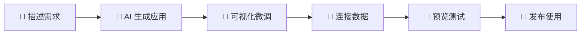
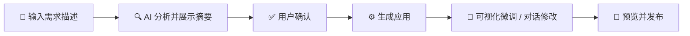
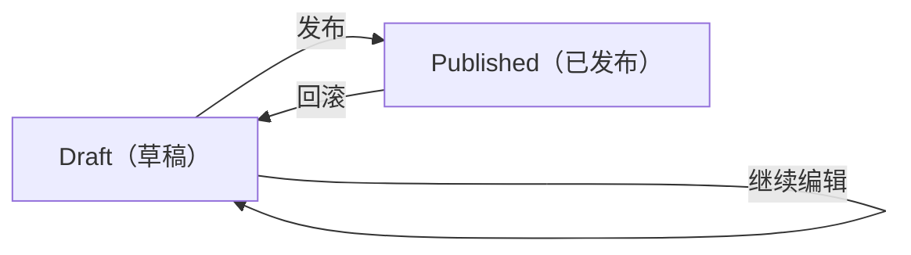
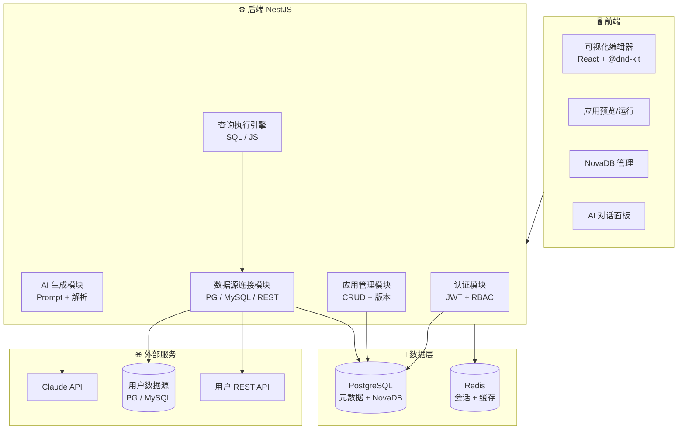
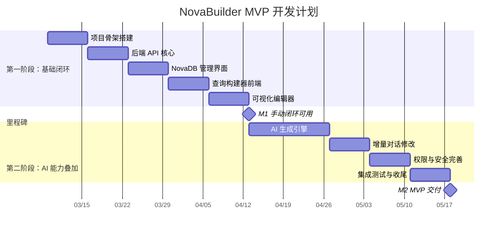
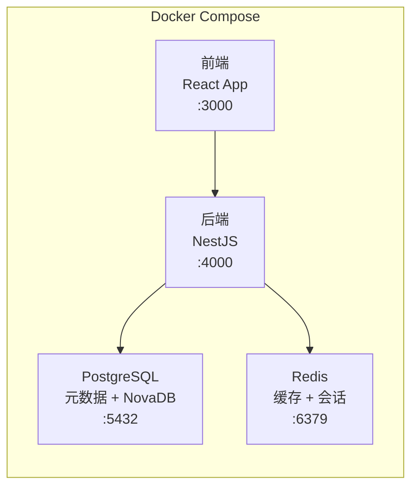
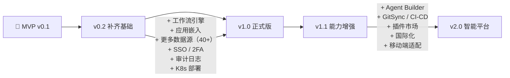

# PRD_NovaBuilder_MVP

创建者: HMJ
创建时间: 2026年3月5日 11:14
类别: 产品文档
上次编辑者: HMJ
上次更新时间: 2026年3月5日 11:23

<aside>
📋

**文档信息**

**产品名称：** NovaBuilder · AI 原生低代码应用开发平台 — **MVP 版本**

**版本：** MVP v0.1　|　**文档日期：** 2026-03-05　|　**状态：** 规划中

**文档作者：** HMJ　|　**参考文档：** [PRD_NovaBuilder](https://www.notion.so/PRD_NovaBuilder-f0937e708cae821f819f81c33b0cb297?pvs=21)（完整版 PRD）

**开发工具：** Claude Code　|　**预估周期：** 8-10 周

</aside>

---

# 一、MVP 目标与策略

## 1.1 MVP 定义

<aside>
🎯

**MVP 核心原则：** 用最小功能集验证产品核心假设——"用户愿意通过 AI + 可视化的方式快速构建内部工具"。砍掉一切非必要功能，聚焦核心体验闭环。

</aside>

MVP 版本的目标是在 **8-10 周** 内交付一个可以让早期用户完成 **"创建应用 → 连接数据 → 发布使用"** 完整流程的最小产品。

### 核心闭环



## 1.2 核心假设验证

| **假设编号** | **核心假设** | **验证标准** | **验证方式** |
| --- | --- | --- | --- |
| H1 | 用户愿意用自然语言描述需求来生成应用 | ≥ 50% 的用户尝试 AI 生成功能 | 埋点统计 |
| H2 | 非技术用户能独立完成一个简单应用 | ≥ 30% 的非技术用户成功创建并发布应用 | 用户行为分析 |
| H3 | 内置数据库能满足初始场景需求 | ≥ 60% 的应用使用 NovaDB 作为数据源 | 数据源使用统计 |
| H4 | 用户愿意为低代码平台付费 | ≥ 10% 的活跃用户表达付费意愿 | 调研问卷 |

## 1.3 MVP 范围决策（In / Out）

| **模块** | **MVP 状态** | **说明** |
| --- | --- | --- |
| 🤖 AI 应用生成（基础版） | ✅ **IN** | 自然语言生成应用 + 增量对话修改，这是核心差异化 |
| 🎨 可视化应用构建器 | ✅ **IN** | 拖拽画布 + 精选 20 个核心组件 |
| 🔍 查询构建器 | ✅ **IN** | 可视化查询 + SQL 代码查询 + JS 查询 |
| 💾 NovaDB 内置数据库 | ✅ **IN** | 表格管理 + 基础 CRUD + SQL 编辑器 |
| 🔌 数据源集成（精选） | ✅ **IN** | 仅支持 PostgreSQL、MySQL、REST API（共 3 类） |
| 🔐 基础权限 | ✅ **IN** | 邮箱登录 + Admin / Builder / End User 三角色 |
| 🐳 Docker 部署 | ✅ **IN** | 仅 Docker Compose 单机部署 |
| 📦 版本管理（极简） | ✅ **IN** | Draft → Published 两态 + 回滚上一版 |
| 🧠 Agent Builder | ❌ **OUT** | 推迟到 v1.1，依赖 AI 基础能力先稳定 |
| ⚙️ 工作流引擎 | ❌ **OUT** | 推迟到 v1.0 正式版，是增值功能非闭环必须 |
| 🌐 应用嵌入 | ❌ **OUT** | 推迟到 v1.0 正式版 |
| 🛒 插件市场 | ❌ **OUT** | 推迟到 v1.0 正式版，需要生态基础 |
| 🔗 SSO / SAML / LDAP | ❌ **OUT** | 推迟到 v1.0 正式版，企业级功能 |
| 📦 GitSync / CI-CD | ❌ **OUT** | 推迟到 v1.1 |
| 🌍 国际化 | ❌ **OUT** | MVP 仅中文界面 |
| 📱 移动端适配 | ❌ **OUT** | MVP 仅桌面端 |
| 🎨 主题系统 / 深色模式 | ❌ **OUT** | MVP 仅默认浅色主题 |

---

# 二、MVP 目标用户

<aside>
👥

**MVP 只聚焦两类核心用户**，不试图满足所有角色。

</aside>

| **用户角色** | **核心画像** | **MVP 核心场景** | **成功标准** |
| --- | --- | --- | --- |
| 🧑‍💻 **开发者** | 有编码经验，希望减少重复 CRUD 开发 | 用 AI + 拖拽快速搭建后台管理工具，连接已有数据库 | 30 分钟内完成一个数据管理应用 |
| 📊 **产品经理** | 有一定技术理解，需要快速验证想法 | 用 AI 生成原型应用，使用 NovaDB 管理数据 | 无需编码即可创建并发布一个功能应用 |

---

# 三、MVP 功能详细设计

## 3.1 AI 应用生成（基础版）

<aside>
🤖

**MVP 范围：** 支持自然语言生成应用和增量对话修改。暂不包含 AI 代码补全、模板推荐等高级 AI 功能。

</aside>

### 功能清单

| **功能** | **MVP 范围** | **验收标准** |
| --- | --- | --- |
| 自然语言生成应用 | 输入文本描述，生成包含 UI + 数据模型的应用 | 支持生成表格、表单、仪表板三种基础应用类型 |
| 需求分析反馈 | AI 解析描述后展示结构化需求摘要，用户确认后生成 | 生成前展示页面列表、组件列表、数据模型预览 |
| 增量对话修改 | 生成后通过对话调整 UI 和查询 | 支持"修改表格列""添加筛选器""更改颜色"等常见指令 |
| AI 查询生成 | 根据描述生成 SQL 查询 | 支持 SELECT / INSERT / UPDATE / DELETE 的基础 SQL |

### 用户流程



### MVP 限制

- 单次生成最多 **3 个页面**
- 仅支持生成使用 **NovaDB** 的应用（不支持生成时连接外部数据源）
- 对话修改仅支持 **单组件级别** 调整，不支持跨页面重构

---

## 3.2 可视化应用构建器

<aside>
🎨

**MVP 范围：** 保留拖拽画布核心体验，组件库从 60+ 精简至 **20 个高频组件**。

</aside>

### 编辑器能力

| **能力** | **MVP 范围** |
| --- | --- |
| 拖拽式画布 | ✅ 组件拖放、对齐辅助线、网格吸附 |
| 组件属性面板 | ✅ 属性配置、数据绑定、基础事件处理 |
| 多页面管理 | ✅ 最多 **10 个页面**，支持页面导航 |
| 实时预览 | ✅ 编辑态和预览态切换 |
| 撤销 / 重做 | ✅ 基础 Undo / Redo |
| 响应式设计 | ❌ MVP 仅桌面端布局 |
| 主题系统 | ❌ MVP 仅默认主题 |

### MVP 组件库（20 个）

| **分类** | **组件** | **选入理由** |
| --- | --- | --- |
| 📊 数据展示（4） | 表格（Table）、列表（ListView）、图表（Chart）、统计卡片（Stat） | 覆盖 90% 的数据展示场景 |
| 📝 表单输入（6） | 文本输入、数字输入、下拉选择、日期选择器、文件上传、富文本编辑器 | 覆盖常见表单录入需求 |
| 📐 布局容器（3） | 容器（Container）、标签页（Tabs）、模态框（Modal） | 满足基础页面结构编排 |
| 🎯 操作反馈（4） | 按钮（Button）、开关（Toggle）、复选框（Checkbox）、加载状态（Spinner） | 核心交互元素 |
| 🖼️ 媒体展示（2） | 图像（Image）、PDF 查看器 | 常见内容展示 |
| 🧭 导航（1） | 侧边栏导航 | 多页面应用导航 |

---

## 3.3 查询构建器（精简版）

### 功能清单

| **功能** | **MVP 状态** | **说明** |
| --- | --- | --- |
| 可视化查询构建 | ✅ | 表单式界面，支持筛选、排序、分页 |
| SQL 代码查询 | ✅ | 手写 SQL，语法高亮（无自动补全） |
| JavaScript 查询 | ✅ | 服务端运行 JS 逻辑 |
| 参数化查询 | ✅ | 组件值动态绑定到查询参数（如 `components.input1.value`） |
| 数据转换 | ✅ | 基础 JS 数据转换 |
| Python 查询 | ❌ | 推迟到 v1.0 |
| 查询链式编排 | ❌ | 推迟到 v1.0 |
| 查询缓存 | ❌ | 推迟到 v1.0 |

### 查询触发方式（MVP）

- ✅ **页面加载自动运行** — 填充初始数据
- ✅ **用户操作触发** — 按钮点击、表单提交
- ❌ 查询联动触发（推迟）
- ❌ 定时轮询（推迟）

---

## 3.4 NovaDB 内置数据库（精简版）

| **功能** | **MVP 状态** | **说明** |
| --- | --- | --- |
| 可视化表格管理 | ✅ | 创建表、增删改查、搜索、排序 |
| 数据类型 | ✅ | 文本、数字、布尔、日期/时间（4 种） |
| 主键 | ✅ | 自动生成主键 |
| SQL 编辑器 | ✅ | 基础 SQL 执行与结果预览 |
| 外键关联 | ❌ | 推迟到 v1.0 |
| JSON 数据类型 | ❌ | 推迟到 v1.0 |
| CSV 批量导入 | ❌ | 推迟到 v1.0 |
| 文件附件 | ❌ | 推迟到 v1.0 |

---

## 3.5 数据源集成（仅 3 类）

<aside>
🔌

**MVP 策略：** 仅支持最核心的 3 类数据源，覆盖绝大多数内部工具场景。

</aside>

| **数据源** | **选入理由** | **连接方式** |
| --- | --- | --- |
| 🐘 PostgreSQL | 最流行的开源关系型数据库，NovaDB 底层也是 PG | 连接字符串 / SSL |
| 🐬 MySQL | 使用最广泛的关系型数据库 | 连接字符串 / SSL |
| 🌐 REST API | 覆盖所有 HTTP 接口的通用集成 | URL + Headers + Auth |

**MVP 内置默认数据源（无需配置）：**

- **NovaDB** — 内置 PostgreSQL 数据库
- **Run JavaScript Query** — 服务端 JS 运行

**数据源管理能力（MVP）：**

- ✅ 连接测试（一键测试连通性）
- ✅ 凭证加密存储（服务端加密，不暴露到前端）
- ❌ 环境隔离（推迟）
- ❌ 连接池管理（推迟）

---

## 3.6 权限与安全（基础版）

### 认证

- ✅ 邮箱 + 密码登录
- ✅ 密码复杂度策略
- ❌ 2FA / SSO / SAML / LDAP（推迟到 v1.0 正式版）

### 角色体系（简化为 3 个）

| **角色** | **权限** |
| --- | --- |
| 🔑 Admin | 管理用户、管理所有应用和数据源、平台设置 |
| 🛠️ Builder | 创建和编辑应用、配置数据源和查询 |
| 👤 End User | 仅使用已发布的应用 |

### 数据安全

- ✅ TLS 传输加密
- ✅ 数据源凭证服务端加密存储
- ✅ 参数化查询（SQL 注入防护）
- ❌ 审计日志（推迟）
- ❌ IP 白名单（推迟）

---

## 3.7 版本管理（极简版）



- ✅ **Draft / Published 两态模型**（省略 Saved Version 层级）
- ✅ 一键发布到生产
- ✅ 回滚到上一个发布版本
- ❌ 多版本快照（推迟）
- ❌ 版本 diff 对比（推迟）
- ❌ 环境管理（推迟，MVP 不区分环境）

---

# 四、技术方案与开发规划

## 4.1 MVP 技术栈

| **层级** | **技术选型** | **说明** |
| --- | --- | --- |
| 前端 | React + TypeScript | 组件化 UI，强类型保障 |
| 拖拽引擎 | @dnd-kit 或 react-dnd | 成熟拖拽方案，降低自研成本 |
| 代码编辑器 | CodeMirror 6 | SQL / JS 编辑器，轻量高性能 |
| 后端 | Node.js（NestJS） | 模块化设计，适合 Claude Code 辅助开发 |
| 数据库 | PostgreSQL | 平台元数据 + NovaDB 底层 |
| 缓存 | Redis | 会话管理 |
| AI 引擎 | Anthropic Claude API | MVP 阶段先对接单一模型，后续扩展多模型 |
| 容器化 | Docker Compose | 单机部署，快速启动 |

## 4.2 系统架构（MVP 精简版）



## 4.3 开发阶段规划

<aside>
💡

**策略：** 先手动闭环再叠 AI。AI 生成的结果本质上是调用构建器的能力，底层稳了 AI 才能可靠。

</aside>

### 第一阶段：基础闭环（第 1-5 周）

**目标：跑通「手动搭建应用」的完整闭环**

| **周次** | **任务** | **交付物** | **Claude Code 适配度** |
| --- | --- | --- | --- |
| 第 1 周 | 项目骨架搭建 | Monorepo 结构、前后端项目初始化、Docker Compose、数据库 Schema、认证模块 | ⭐⭐⭐⭐⭐ 非常适合 |
| 第 2 周 | 后端 API 核心 | 应用 CRUD API、数据源连接模块（PG/MySQL/REST）、查询执行引擎 | ⭐⭐⭐⭐⭐ 非常适合 |
| 第 3 周 | NovaDB 管理界面 | 表管理、数据 CRUD、SQL 编辑器（CodeMirror） | ⭐⭐⭐⭐⭐ 非常适合 |
| 第 4 周 | 查询构建器前端 | 可视化查询表单、SQL 编辑器、查询结果展示、参数绑定 | ⭐⭐⭐⭐ 很适合 |
| 第 5 周 | 可视化编辑器（核心） | 拖拽画布、20 个组件、属性面板、数据绑定、预览发布 | ⭐⭐⭐ 需要人工把控架构 |

### 第二阶段：AI 能力叠加（第 6-10 周）

| **周次** | **任务** | **交付物** | **Claude Code 适配度** |
| --- | --- | --- | --- |
| 第 6-7 周 | AI 生成引擎 | Prompt 体系设计、需求解析模块、应用 JSON 生成、AI 对话面板 UI | ⭐⭐⭐⭐ 代码部分适合，Prompt 设计需人工主导 |
| 第 8 周 | 增量对话修改 | 对话式 UI 修改、AI 查询生成、修改预览与确认 | ⭐⭐⭐⭐ 很适合 |
| 第 9 周 | 权限与安全完善 | RBAC 权限控制、凭证加密、SQL 注入防护、版本管理 | ⭐⭐⭐⭐⭐ 非常适合 |
| 第 10 周 | 集成测试与收尾 | 端到端测试、Bug 修复、部署文档、README | ⭐⭐⭐⭐ 很适合 |

### 里程碑



## 4.4 Claude Code 开发最佳实践

<aside>
🛠️

以下是用 Claude Code 开发 NovaBuilder MVP 的关键策略。

</aside>

### 高效协作模式

1. **先定义接口，再填充实现** — 每个模块先写好 TypeScript 类型定义和接口声明，再让 Claude Code 生成实现代码，质量会显著提升
2. **模块化推进** — 每次聚焦一个独立模块，提供充分上下文（相关类型、依赖接口），避免一次性生成过多代码
3. **站在开源方案肩膀上** — 可视化编辑器参考 ToolJet 的编辑器架构来改造，而非从零搭建

### 各模块适配策略

| **模块** | **策略** |
| --- | --- |
| NestJS 后端 API | Claude Code 直接生成，效率极高。提供 Entity 定义即可批量生成 Controller / Service / DTO |
| NovaDB 管理界面 | 标准 CRUD 界面，Claude Code 一站式搞定 |
| 查询构建器 | 表单 UI + CodeMirror 集成，Claude Code 处理核心逻辑，人工调 UX 细节 |
| 可视化编辑器 | **最复杂模块**，建议先人工设计组件树数据结构和状态管理方案，再让 Claude Code 实现具体组件和交互 |
| AI 生成能力 | Claude Code 生成调用代码和解析逻辑；Prompt 模板设计需人工主导和反复调优 |

---

# 五、部署方案

<aside>
🐳

**MVP 仅支持 Docker Compose 单机部署**，快速启动，降低运维门槛。

</aside>

### 部署架构



### 一键启动

```bash
git clone https://github.com/novabuilder/novabuilder.git
cd novabuilder
cp .env.example .env
docker-compose up -d
```

### 最低配置要求

- CPU：2 核
- 内存：4 GB
- 硬盘：20 GB
- Docker Engine 20.10+

---

# 六、非功能性需求（MVP）

| **指标** | **MVP 目标** | **说明** |
| --- | --- | --- |
| 页面首次加载 | ≤ 5 秒 | MVP 放宽标准（正式版 ≤ 3 秒） |
| 查询响应 | ≤ 3 秒（P95） | 常规查询端到端响应 |
| AI 生成时间 | ≤ 45 秒 | 从输入到生成完整应用 |
| 并发用户 | ≥ 50 | 单机部署下的并发能力 |
| 数据备份 | 手动备份 | 提供 pg_dump 脚本，不做自动备份 |

---

# 七、MVP 成功指标

| **指标类别** | **指标名称** | **MVP 目标** | **衡量方式** |
| --- | --- | --- | --- |
| 核心闭环 | 应用创建完成率 | ≥ 40% 的用户成功创建并发布至少一个应用 | 操作埋点 |
| AI 差异化 | AI 生成功能使用率 | ≥ 50% 的用户至少尝试一次 AI 生成 | 埋点统计 |
| AI 质量 | AI 生成应用采纳率 | ≥ 40% 的 AI 生成应用被保留并发布 | 生成后保留比例 |
| 用户体验 | 首个应用创建时间 | ≤ 30 分钟（简单应用） | 操作埋点 |
| 用户满意度 | NPS 净推荐值 | ≥ 30 | 用户调研 |

---

# 八、风险与应对

| **风险** | **影响** | **概率** | **应对策略** |
| --- | --- | --- | --- |
| 可视化编辑器复杂度超预期 | 高 | 高 | 参考 ToolJet 开源编辑器架构，降低自研成本；必要时进一步精简组件数 |
| AI 生成质量不稳定 | 高 | 中 | 建立 Prompt 模板库 + 生成前预览确认 + 限制生成范围（仅 3 类应用） |
| MVP 周期延期 | 中 | 中 | 严格控制范围（不加 OUT 列表的功能）；第一阶段闭环可独立交付 |
| 20 个组件不够用 | 低 | 中 | 通过用户反馈确定优先补充的组件；组件架构设计支持快速扩展 |

---

# 九、MVP → v1.0 演进路径

<aside>
📈

**MVP 验证通过后**，按以下优先级逐步补齐完整版 v1.0 能力（详见 [PRD_NovaBuilder](https://www.notion.so/PRD_NovaBuilder-f0937e708cae821f819f81c33b0cb297?pvs=21)）。

</aside>



| 阶段 | 重点补齐 |
| --- | --- |
| MVP → v0.2 | 组件库扩展到 40+、更多数据源、CSV 导入、查询缓存、查询联动 |
| v0.2 → v1.0 | 工作流引擎、应用嵌入、SSO/2FA、审计日志、K8s 部署、环境管理、SaaS 云端 |
| v1.0 → v1.1 | Agent Builder、GitSync、CI-CD、插件市场、国际化、移动端 |
| v1.1 → v2.0 | 多 Agent 协作、多租户、自定义插件 SDK、行业解决方案 |

---

<aside>
📝

*本文档为 NovaBuilder MVP 版本的精简 PRD，完整产品规划详见 [PRD_NovaBuilder](https://www.notion.so/PRD_NovaBuilder-f0937e708cae821f819f81c33b0cb297?pvs=21)。*

</aside>