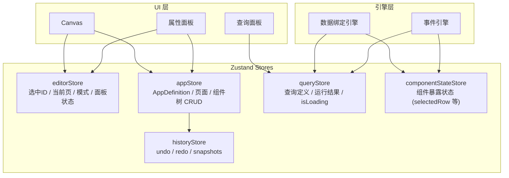

# NovaBuilder v2 前端架构 + UI 设计规范

创建者: HMJ
创建时间: 2026年3月11日 12:43
类别: 产品文档
上次编辑者: HMJ
上次更新时间: 2026年3月11日 12:47

<aside>
📋

**文档信息**

**产品名称：** NovaBuilder · AI 原生低代码应用开发平台 — **v2 前端架构 + UI 设计规范**

**版本：** v2.0　|　**文档日期：** 2026-03-11　|　**状态：** 规划中

**文档作者：** HMJ

**用途：** v2 前端重写的架构蓝图和视觉规范，供 Claude Code 生成代码时严格遵循

**关联文档：** [NovaBuilder 前端架构问题清单（v1 复盘）](https://www.notion.so/NovaBuilder-v1-a42f83383533454aa9d6efd3ae7be38e?pvs=21)　|　[NovaBuilder MVP 技术架构](https://www.notion.so/NovaBuilder-MVP-fe6c951921554f16910dbc39aff353c3?pvs=21)　|　[NovaBuilder MVP 界面设计](https://www.notion.so/NovaBuilder-MVP-acbf2d1971554de59cb6e7abfbb51a1d?pvs=21)

</aside>

---

# 第一部分：UI 设计规范

<aside>
🎨

**设计理念：** 简洁、专业、和谐。借鉴 Linear、Figma、ToolJet 的视觉风格——大量留白、低饱和度配色、精致图标、微妙动效。让用户感受到"工具的高级感"而非"后台管理系统"。

</aside>

## 1.1 配色系统

### 品牌色

| **名称** | **色值** | **CSS 变量** | **用途** |
| --- | --- | --- | --- |
| Brand Primary | `#2563EB` | `--nb-brand-primary` | 主按钮、链接、选中态、品牌标识 |
| Brand Light | `#EFF6FF` | `--nb-brand-light` | 选中行背景、悬浮态背景 |
| Brand Dark | `#1E40AF` | `--nb-brand-dark` | 按钮 hover、深色品牌元素 |

### 中性色（灰度系统）

| **名称** | **色值** | **CSS 变量** | **用途** |
| --- | --- | --- | --- |
| Gray 950 | `#0C0C0D` | `--nb-gray-950` | 编辑器顶栏背景 |
| Gray 800 | `#1F2937` | `--nb-gray-800` | 标题文字 |
| Gray 600 | `#4B5563` | `--nb-gray-600` | 正文文字 |
| Gray 400 | `#9CA3AF` | `--nb-gray-400` | 占位符、辅助文字 |
| Gray 200 | `#E5E7EB` | `--nb-gray-200` | 边框、分割线 |
| Gray 100 | `#F3F4F6` | `--nb-gray-100` | 面板背景、输入框背景 |
| Gray 50 | `#F9FAFB` | `--nb-gray-50` | 画布背景、页面底色 |
| White | `#FFFFFF` | `--nb-white` | 卡片、模态框、内容区背景 |

### 语义色

| **名称** | **色值** | **CSS 变量** | **用途** |
| --- | --- | --- | --- |
| Success | `#10B981` | `--nb-success` | 成功状态、已发布、已连接 |
| Warning | `#F59E0B` | `--nb-warning` | 警告提示 |
| Error | `#EF4444` | `--nb-error` | 错误、删除、断开连接 |
| Info | `#3B82F6` | `--nb-info` | 信息提示 |

### 配色使用规则

- **背景色不超过 3 层**：White（内容区）→ Gray 50（画布底色）→ Gray 100（面板）
- **文字颜色只用 3 档**：Gray 800（标题）→ Gray 600（正文）→ Gray 400（辅助）
- **品牌色只用于可交互元素**：按钮、链接、选中态、开关
- **语义色只用于状态指示**：不用于装饰

---

## 1.2 字体系统

| **层级** | **字号** | **字重** | **行高** | **CSS 变量** | **用途** |
| --- | --- | --- | --- | --- | --- |
| H1 页面标题 | 24px | 600 | 32px | `--nb-text-h1` | 页面主标题（应用列表"我的应用"） |
| H2 区域标题 | 16px | 600 | 24px | `--nb-text-h2` | 面板标题、分组标题 |
| H3 小标题 | 14px | 600 | 20px | `--nb-text-h3` | 属性分组标题 |
| Body 正文 | 13px | 400 | 20px | `--nb-text-body` | 正文、表格内容、输入框 |
| Caption 辅助 | 12px | 400 | 16px | `--nb-text-caption` | 提示文字、标签、时间戳 |
| Code 代码 | 13px | 400 | 20px | `--nb-text-code` | 代码编辑器、表达式 |

**字体栈：**

```css
--nb-font-sans: 'Inter', -apple-system, BlinkMacSystemFont, 'Segoe UI', sans-serif;
--nb-font-mono: 'JetBrains Mono', 'SF Mono', 'Fira Code', monospace;
```

- **Inter** 作为主字体（需引入 Google Fonts 或本地加载），英文场景下视觉效果最佳
- 中文自动 fallback 到系统字体（-apple-system → PingFang SC → Microsoft YaHei）
- 代码区域统一用 JetBrains Mono（等宽、编程友好）

---

## 1.3 间距系统

采用 **4px 基数** 的间距刻度：

| **Token** | **值** | **CSS 变量** | **典型用途** |
| --- | --- | --- | --- |
| space-1 | 4px | `--nb-space-1` | 图标与文字间距、紧凑列表项间距 |
| space-2 | 8px | `--nb-space-2` | 表单字段间距、小组件内边距 |
| space-3 | 12px | `--nb-space-3` | 面板内边距、卡片内边距 |
| space-4 | 16px | `--nb-space-4` | 区块间距、Section 间隔 |
| space-5 | 20px | `--nb-space-5` | 大区块间距 |
| space-6 | 24px | `--nb-space-6` | 页面边距、模态框内边距 |
| space-8 | 32px | `--nb-space-8` | 页面级大间距 |

**规则：** 所有间距必须使用 Token，禁止出现 5px、10px、15px 等非刻度值。

---

## 1.4 圆角与阴影

### 圆角

| **Token** | **值** | **CSS 变量** | **用途** |
| --- | --- | --- | --- |
| radius-sm | 4px | `--nb-radius-sm` | 小元素（Tag、Badge） |
| radius-md | 6px | `--nb-radius-md` | 输入框、按钮、选择器 |
| radius-lg | 8px | `--nb-radius-lg` | 卡片、面板、弹窗 |
| radius-xl | 12px | `--nb-radius-xl` | 大卡片、全屏弹窗 |

### 阴影

| **Token** | **值** | **CSS 变量** | **用途** |
| --- | --- | --- | --- |
| shadow-sm | `0 1px 2px rgba(0,0,0,0.05)` | `--nb-shadow-sm` | 输入框 focus、小卡片 |
| shadow-md | `0 2px 8px rgba(0,0,0,0.08)` | `--nb-shadow-md` | 浮动面板、下拉菜单 |
| shadow-lg | `0 8px 24px rgba(0,0,0,0.12)` | `--nb-shadow-lg` | 模态框、全屏覆盖 |
| shadow-border | `0 0 0 1px rgba(0,0,0,0.05)` | `--nb-shadow-border` | 代替 border 的轻量边框效果 |

---

## 1.5 图标系统

<aside>
✨

**统一使用 Lucide Icons** — 一致性强、支持 tree-shaking、与 React 生态集成好、风格简洁现代。

安装：`pnpm add lucide-react`

</aside>

### 图标使用规范

| **场景** | **Size** | **strokeWidth** | **颜色** |
| --- | --- | --- | --- |
| 编辑器左侧图标栏 | 20px | 1.5 | Gray 400（默认）→ Brand Primary（激活） |
| 面板内操作图标 | 16px | 1.5 | Gray 400（默认）→ Gray 800（hover） |
| 组件面板组件图标 | 24px | 1.5 | Gray 600 |
| 按钮内图标 | 16px | 2 | 跟随按钮文字色 |
| 状态图标 | 14px | 2 | 语义色（Success/Error/Warning） |

### 关键位置图标映射

| **位置** | **图标名称（Lucide）** | **说明** |
| --- | --- | --- |
| 左侧图标栏 — 组件 | `LayoutGrid` | 组件面板 |
| 左侧图标栏 — 页面 | `FileText` | 页面管理 |
| 左侧图标栏 — 组件树 | `GitBranch` | 组件树结构 |
| 左侧图标栏 — 查询 | `Database` | 查询管理 |
| 顶栏 — 返回 | `ArrowLeft` | 返回应用列表 |
| 顶栏 — 撤销/重做 | `Undo2` / `Redo2` | 操作历史 |
| 顶栏 — 预览 | `Eye` | 预览模式 |
| 顶栏 — 发布 | `Rocket` | 发布应用 |
| 顶栏 — AI | `Sparkles` | AI 助手 |
| 添加/新建 | `Plus` | 统一用 Plus，不用 PlusCircle |
| 删除 | `Trash2` | 统一用 Trash2 |
| 设置/配置 | `Settings` | 齿轮图标 |
| 搜索 | `Search` | 搜索框图标 |
| 更多操作 | `MoreHorizontal` | 三点菜单 |
| 拖拽手柄 | `GripVertical` | 拖拽排序手柄 |

---

## 1.6 动效规范

| **动效类型** | **duration** | **easing** | **CSS 变量** |
| --- | --- | --- | --- |
| 快速反馈（hover、focus） | 120ms | ease-out | `--nb-transition-fast` |
| 标准过渡（展开、切换） | 200ms | ease-in-out | `--nb-transition-normal` |
| 慢速过渡（模态框、页面） | 300ms | cubic-bezier(0.4, 0, 0.2, 1) | `--nb-transition-slow` |

**规则：**

- 面板展开/收起：200ms slide + fade
- 下拉菜单/弹窗：300ms fade-in + scale(0.95→1)
- 按钮 hover：120ms 背景色渐变
- 拖拽组件：无动效（实时跟随鼠标，不延迟）

---

## 1.7 组件选中态与交互视觉

### 画布上组件的三种状态

```
默认态（未选中、未悬浮）：
┌──────────────────────┐
│  组件内容              │   无额外装饰
└──────────────────────┘

悬浮态（鼠标 hover）：
┌╌╌╌╌╌╌╌╌╌╌╌╌╌╌╌╌╌╌╌╌╌╌┐
╎  组件内容              ╎   1px 虚线边框 #93C5FD (brand-light)
└╌╌╌╌╌╌╌╌╌╌╌╌╌╌╌╌╌╌╌╌╌╌┘

选中态：
┌─ table1 ─────────────────┐
│                          │   1px 实线边框 #2563EB (brand-primary)
│  组件内容                 │   左上角标签：蓝色背景白色文字 12px
│                    ○ ○ ○ │   四角 + 四边中点共 8 个 resize handle
└──────────────────── ○ ○ ○┘
```

### Resize Handle 样式

- **尺寸：** 6px × 6px 圆角方块
- **默认态：** 白色填充 + 1px #2563EB 边框
- **Hover 态：** #2563EB 填充
- **四角手柄：** 正方形，cursor: nwse-resize / nesw-resize
- **四边中点：** 正方形，cursor: ns-resize / ew-resize

---

## 1.8 Ant Design 主题定制

通过 `ConfigProvider` 注入全局主题 Token：

```tsx
// theme/antdTheme.ts
import { ThemeConfig } from 'antd';

export const antdTheme: ThemeConfig = {
  token: {
    // 品牌色
    colorPrimary: '#2563EB',
    colorSuccess: '#10B981',
    colorWarning: '#F59E0B',
    colorError: '#EF4444',
    colorInfo: '#3B82F6',
    
    // 中性色
    colorText: '#1F2937',
    colorTextSecondary: '#4B5563',
    colorTextTertiary: '#9CA3AF',
    colorBorder: '#E5E7EB',
    colorBgContainer: '#FFFFFF',
    colorBgLayout: '#F9FAFB',
    
    // 圆角
    borderRadius: 6,
    borderRadiusSM: 4,
    borderRadiusLG: 8,
    
    // 字体
    fontFamily: "'Inter', -apple-system, BlinkMacSystemFont, 'Segoe UI', sans-serif",
    fontSize: 13,
    fontSizeSM: 12,
    fontSizeLG: 16,
    
    // 间距
    padding: 12,
    paddingSM: 8,
    paddingLG: 16,
    margin: 12,
    marginSM: 8,
    marginLG: 16,
    
    // 阴影
    boxShadow: '0 2px 8px rgba(0,0,0,0.08)',
    boxShadowSecondary: '0 8px 24px rgba(0,0,0,0.12)',
  },
  components: {
    Button: {
      borderRadius: 6,
      controlHeight: 32,
      controlHeightSM: 28,
    },
    Input: {
      borderRadius: 6,
      controlHeight: 32,
    },
    Table: {
      borderRadius: 8,
      headerBg: '#F9FAFB',
      headerColor: '#4B5563',
      fontSize: 13,
    },
    Select: {
      borderRadius: 6,
      controlHeight: 32,
    },
    Tabs: {
      fontSize: 13,
    },
  },
};
```

---

# 第二部分：前端架构设计

## 2.1 目录结构

```
packages/frontend/src/
├── main.tsx                          # 入口
├── App.tsx                           # 根组件（ConfigProvider + Router）
├── theme/                            # 🎨 设计系统
│   ├── tokens.css                    # CSS 变量定义（--nb-*）
│   ├── antdTheme.ts                  # Ant Design 主题配置
│   ├── global.css                    # 全局样式重置
│   └── utils.module.css              # 通用 utility 类
├── api/                              # 🌐 API 客户端（保留 v1）
│   ├── client.ts
│   ├── auth.api.ts
│   ├── app.api.ts
│   ├── query.api.ts
│   ├── datasource.api.ts
│   ├── novadb.api.ts
│   └── ai.api.ts
├── stores/                           # 📦 Zustand 状态管理（v2 重新划分）
│   ├── authStore.ts                  # 认证状态
│   ├── editorStore.ts                # 编辑器 UI 状态（选中、模式、面板）
│   ├── appStore.ts                   # 应用定义（AppDefinition、页面、组件树）
│   ├── queryStore.ts                 # 查询定义 + 运行结果
│   ├── componentStateStore.ts        # 组件暴露状态（exposed state）
│   └── historyStore.ts               # 撤销/重做
├── engine/                           # ⚙️ 核心引擎
│   ├── dnd/                          # 拖拽引擎
│   │   ├── useDndSensors.ts          # Sensor 配置（activationConstraint）
│   │   ├── DndProvider.tsx           # DnD 上下文
│   │   └── useDroppable.ts
│   ├── renderer/                     # 渲染引擎
│   │   ├── ComponentRenderer.tsx     # 单组件渲染（编辑态/运行态）
│   │   └── PageRenderer.tsx          # 整页渲染
│   ├── binding/                      # 数据绑定引擎
│   │   ├── evaluator.ts              # 表达式求值
│   │   ├── context.ts                # 求值上下文构建
│   │   └── useBinding.ts             # React Hook
│   └── event/                        # 事件引擎
│       ├── eventBus.ts               # 事件总线
│       └── actionRunner.ts           # Action 执行器
├── registry/                         # 🧩 组件注册表
│   ├── index.ts                      # Registry 类 + 注册入口
│   ├── types.ts                      # ComponentDefinition 接口
│   └── components/                   # 20 个组件
│       ├── Table/
│       │   ├── index.ts              # 注册入口
│       │   ├── render.tsx            # 渲染组件
│       │   ├── schema.ts             # propertySchema 定义
│       │   ├── state.ts              # exposedState 定义
│       │   └── style.module.css      # 组件样式
│       ├── Button/
│       ├── TextInput/
│       ├── Select/
│       ├── NumberInput/
│       ├── DatePicker/
│       ├── FileUpload/
│       ├── RichText/
│       ├── Container/
│       ├── Tabs/
│       ├── Modal/
│       ├── Toggle/
│       ├── Checkbox/
│       ├── Spinner/
│       ├── Image/
│       ├── PDFViewer/
│       ├── Sidebar/
│       ├── ListView/
│       ├── Chart/
│       └── Stat/
├── components/                       # 🔧 通用 UI 组件
│   ├── Layout/
│   │   ├── EditorLayout.tsx          # 编辑器整体布局容器
│   │   ├── EditorTopBar.tsx          # 编辑器顶栏
│   │   ├── IconSidebar.tsx           # 左侧图标栏（40px）
│   │   ├── ExpandablePanel.tsx       # 可展开浮动面板
│   │   └── AppLayout.tsx             # 标准页面布局
│   ├── PropertyPanel/                # 属性面板
│   │   ├── PropertyPanel.tsx         # 面板容器
│   │   ├── PropertyRenderer.tsx      # Schema 驱动的属性渲染器
│   │   └── renderers/                # 各类型属性渲染器
│   │       ├── TextRenderer.tsx
│   │       ├── NumberRenderer.tsx
│   │       ├── BooleanRenderer.tsx
│   │       ├── SelectRenderer.tsx
│   │       ├── ExpressionRenderer.tsx
│   │       ├── ColumnsRenderer.tsx
│   │       ├── DataSourceRenderer.tsx
│   │       ├── EventRenderer.tsx
│   │       └── ColorRenderer.tsx
│   ├── QueryPanel/                   # 查询面板
│   ├── Canvas/                       # 画布组件
│   │   ├── Canvas.tsx                # 画布容器
│   │   ├── CanvasComponent.tsx       # 画布上的组件包装器
│   │   ├── SelectionBox.tsx          # 选中框 + resize handle
│   │   ├── AlignmentGuides.tsx       # 对齐辅助线
│   │   └── canvas.module.css
│   └── AIChat/                       # AI 对话面板
└── pages/                            # 📄 路由页面
    ├── Login/
    ├── Register/
    ├── Dashboard/                    # 应用列表
    ├── Editor/                       # 编辑器主页面
    │   └── EditorPage.tsx
    ├── Preview/
    ├── NovaDB/
    ├── DataSource/
    └── Admin/
```

---

## 2.2 状态管理架构（v2 重新划分）



### Store 职责清单

| **Store** | **职责** | **不管的事** |
| --- | --- | --- |
| `editorStore` | selectedComponentId、currentPageId、mode（edit/preview）、左/右/底面板展开状态、缩放比例 | 不存任何业务数据（组件树、查询、应用信息） |
| `appStore` | AppDefinition、pages CRUD、components CRUD（add/remove/update/move）、appName、appId、isDirty、autoSave | 不管 UI 状态（谁被选中、面板开关） |
| `queryStore` | 查询定义列表、查询运行结果（data/isLoading/error）、runQuery()、setQueryResult() | 不管 UI（查询面板展开/收起） |
| `componentStateStore` | 各组件暴露的运行时状态，如 `states['table1'].selectedRow` | 不管组件定义（那是 appStore 的事） |
| `historyStore` | 快照栈、undo()、redo()、canUndo、canRedo | 不管具体修改内容，只管快照 |

---

## 2.3 编辑器布局架构

### JSX 嵌套结构（v2 明确规定）

```tsx
<EditorPage>
  {/* 层级 1: 全屏容器 */}
  <div className="editor-root" style=toolu_01TxXfbzVBoiT4RxyZpYvSuC>
    
    {/* 层级 2: 编辑器顶栏 — 固定 48px */}
    <EditorTopBar />
    
    {/* 层级 3: 主体区域 — flex:1 */}
    <div className="editor-body" style=toolu_01D4GFidp53WWd6caeUqbavU>
      
      {/* 左侧图标栏 — 固定 40px, 正常流 */}
      <IconSidebar />
      
      {/* 中间主区域 — flex:1, position:relative */}
      <div className="editor-main" style=toolu_01MHups1Z4nYfzEjRUfxAZPn>
        
        {/* Canvas + 底部查询面板 — 正常流, flex:1 + auto */}
        <div className="editor-canvas-area" style=toolu_01L6sAWxVkxqMgvGVBkdsDr3>
          <Canvas />  {/* flex: 1 */}
          <QueryPanel />  {/* 固定高度或折叠, 正常流 */}
        </div>
        
        {/* 左侧展开面板 — absolute, left:0, z-index:10 */}
        {leftPanelOpen && <ExpandablePanel side="left" />}
        
        {/* 右侧属性面板 — absolute, right:0, z-index:10 */}
        {rightPanelOpen && <ExpandablePanel side="right" />}
      </div>
      
    </div>
  </div>
</EditorPage>
```

### 布局规则

| **区域** | **定位方式** | **尺寸** | **z-index** |
| --- | --- | --- | --- |
| EditorTopBar | 正常流（flex item） | 高度 48px, 宽度 100% | auto |
| IconSidebar | 正常流（flex item） | 宽度 40px, 高度 100% | auto |
| Canvas | 正常流（flex: 1） | 自适应 | auto |
| QueryPanel | 正常流（flex item） | 高度 280px 可折叠 | auto |
| LeftPanel（展开） | **absolute** | 宽度 260px | **10** |
| RightPanel（属性面板） | **absolute** | 宽度 320px | **10** |

**关键原则：**

1. **Canvas 和 QueryPanel 始终在正常流中**，不受面板影响
2. **左右展开面板浮动覆盖**，不压缩 Canvas
3. **面板收起 = 组件隐藏（display:none）**，不卸载，保留状态
4. **不使用 margin 给面板让位**，面板通过 absolute 浮在上层

---

## 2.4 组件系统架构

### 组件定义接口（v2）

```tsx
// registry/types.ts

interface ComponentDefinition {
  type: string;                        // 'Table' | 'Button' | ...
  metadata: {
    name: string;                      // 中文显示名
    nameEn: string;                    // 英文名（用于标签）
    icon: string;                      // Lucide 图标名，如 'Table2'
    category: ComponentCategory;       // 分类
    description: string;               // 一句话描述
  };
  render: React.FC<ComponentRenderProps>;  // 渲染组件
  propertySchema: PropertyField[];         // 属性 Schema → 自动生成属性面板
  defaultProps: Record<string, any>;       // 默认属性值
  exposedState: ExposedStateField[];       // 暴露状态定义
  eventDefs: EventDef[];                   // 支持的事件
  layoutDefaults: {
    width: number;
    height: number;
    minWidth?: number;
    minHeight?: number;
  };
}

// 属性 Schema 字段
interface PropertyField {
  key: string;                          // 属性路径，如 'pagination.pageSize'
  label: string;                        // 显示名称
  type: PropertyType;                   // 渲染器类型
  group?: string;                       // 分组名（如 '数据'、'分页'、'搜索'）
  showWhen?: string;                    // 条件显示表达式
  placeholder?: string;
  options?: { label: string; value: any }[];  // select 类型的选项
  defaultValue?: any;
}

type PropertyType = 
  | 'text' | 'number' | 'boolean' | 'select'
  | 'expression'    // 表达式输入框
  | 'color'         // 颜色选择器
  | 'columns'       // 列配置编辑器（Table 专用）
  | 'dataSource'    // 数据源选择器（查询列表 + Raw JSON）
  | 'event'         // 事件配置器
  | 'icon'          // 图标选择器
  | 'code';         // 代码编辑器

// 暴露状态字段
interface ExposedStateField {
  key: string;                  // 'selectedRow'
  label: string;                // '选中行'
  type: 'any' | 'array' | 'string' | 'number' | 'boolean';
  defaultValue: any;
}
```

### 组件开发模板

每个新组件都按这个模板创建：

```
registry/components/Table/
├── index.ts           # 注册入口：import + registerComponent()
├── render.tsx         # 渲染组件：React.FC<ComponentRenderProps>
├── schema.ts          # 属性 Schema + 默认值 + 暴露状态 + 事件
├── state.ts           # 暴露状态的更新逻辑（写入 componentStateStore）
└── style.module.css   # 组件特有样式
```

---

## 2.5 属性面板架构

属性面板 **100% 由 Schema 驱动**，零硬编码：

```tsx
// PropertyPanel.tsx
const PropertyPanel: React.FC = () => {
  const selectedId = useEditorStore(s => s.selectedComponentId);
  const component = useAppStore(s => s.getComponent(selectedId));
  const definition = registry.get(component.type);
  
  return (
    <div className={styles.panel}>
      {/* 头部：组件类型图标 + 名称 + 关闭 */}
      <PanelHeader component={component} definition={definition} />
      
      {/* Tabs: 属性 | 样式 | 事件 */}
      <Tabs>
        <TabPane tab="属性">
          {/* 按 group 分组渲染 */}
          {groupedSchema.map(group => (
            <PropertyGroup key={group.name} title={group.name}>
              {group.fields.map(field => (
                <PropertyRenderer
                  key={field.key}
                  field={field}
                  value={getNestedValue(component.properties, field.key)}
                  onChange={(val) => updateProp(field.key, val)}
                />
              ))}
            </PropertyGroup>
          ))}
        </TabPane>
        <TabPane tab="样式">
          <StyleEditor component={component} />
        </TabPane>
        <TabPane tab="事件">
          <EventEditor events={component.events} eventDefs={definition.eventDefs} />
        </TabPane>
      </Tabs>
    </div>
  );
};

// PropertyRenderer — 根据 field.type 选择渲染器
const PropertyRenderer: React.FC<{ field, value, onChange }> = ({ field, value, onChange }) => {
  const Renderer = rendererMap[field.type]; // text→TextRenderer, columns→ColumnsRenderer, ...
  return <Renderer field={field} value={value} onChange={onChange} />;
};
```

---

## 2.6 数据绑定引擎

### 求值上下文

```tsx
// engine/binding/context.ts
interface EvalContext {
  queries: Record<string, {
    data: any;
    isLoading: boolean;
    error: string | null;
    rowCount: number;
  }>;
  components: Record<string, {
    // 来自 componentStateStore 的暴露状态
    [key: string]: any;  // selectedRow, value, checked, ...
  }>;
  currentUser: {
    id: string;
    email: string;
    role: string;
    name: string;
  };
  urlParams: Record<string, string>;
  currentPage: {
    id: string;
    name: string;
  };
}
```

### 表达式求值

```tsx
// engine/binding/evaluator.ts
function evaluateExpression(expr: string, context: EvalContext): any {
  // 1. 匹配 简写（如 queries.getUsers.data）
  // 2. 安全求值（使用 new Function，不用 eval）
  // 3. 白名单：只允许访问 context 上的属性
  // 4. 错误处理：求值失败返回 undefined，不抛异常
}

// 使用 Hook
function useBinding(expression: string): any {
  const queryResults = useQueryStore(s => s.results);
  const componentStates = useComponentStateStore(s => s.states);
  const context = buildContext(queryResults, componentStates);
  return useMemo(() => evaluateExpression(expression, context), [expression, context]);
}
```

---

## 2.7 拖拽引擎

### @dnd-kit 配置

```tsx
// engine/dnd/useDndSensors.ts
import { useSensor, useSensors, PointerSensor } from '@dnd-kit/core';

export function useDndSensors() {
  return useSensors(
    useSensor(PointerSensor, {
      activationConstraint: {
        distance: 5,  // 移动 5px 才触发拖拽，否则视为点击
      },
    })
  );
}
```

**关键点：** 使用 `distance: 5` 的 activationConstraint 替代 v1 的手写 mousedown/mouseup 时间判定。移动不超过 5px = 点击（选中组件），超过 5px = 拖拽（移动组件）。

---

## 2.8 CSS 架构

### 样式分层

```
theme/tokens.css          → CSS 变量定义（最高层，全局生效）
theme/global.css          → 全局重置 + 基础样式
theme/antdTheme.ts        → Ant Design 主题覆盖
components/**/*.module.css → 组件级样式（CSS Module，局部作用域）
inline style              → 仅用于动态计算值（x/y/width/height）
```

### tokens.css 示例

```css
:root {
  /* 品牌色 */
  --nb-brand-primary: #2563EB;
  --nb-brand-light: #EFF6FF;
  --nb-brand-dark: #1E40AF;
  
  /* 中性色 */
  --nb-gray-950: #0C0C0D;
  --nb-gray-800: #1F2937;
  --nb-gray-600: #4B5563;
  --nb-gray-400: #9CA3AF;
  --nb-gray-200: #E5E7EB;
  --nb-gray-100: #F3F4F6;
  --nb-gray-50: #F9FAFB;
  --nb-white: #FFFFFF;
  
  /* 语义色 */
  --nb-success: #10B981;
  --nb-warning: #F59E0B;
  --nb-error: #EF4444;
  --nb-info: #3B82F6;
  
  /* 间距 */
  --nb-space-1: 4px;
  --nb-space-2: 8px;
  --nb-space-3: 12px;
  --nb-space-4: 16px;
  --nb-space-5: 20px;
  --nb-space-6: 24px;
  --nb-space-8: 32px;
  
  /* 圆角 */
  --nb-radius-sm: 4px;
  --nb-radius-md: 6px;
  --nb-radius-lg: 8px;
  --nb-radius-xl: 12px;
  
  /* 阴影 */
  --nb-shadow-sm: 0 1px 2px rgba(0,0,0,0.05);
  --nb-shadow-md: 0 2px 8px rgba(0,0,0,0.08);
  --nb-shadow-lg: 0 8px 24px rgba(0,0,0,0.12);
  --nb-shadow-border: 0 0 0 1px rgba(0,0,0,0.05);
  
  /* 字体 */
  --nb-font-sans: 'Inter', -apple-system, BlinkMacSystemFont, 'Segoe UI', sans-serif;
  --nb-font-mono: 'JetBrains Mono', 'SF Mono', 'Fira Code', monospace;
  
  /* 过渡 */
  --nb-transition-fast: 120ms ease-out;
  --nb-transition-normal: 200ms ease-in-out;
  --nb-transition-slow: 300ms cubic-bezier(0.4, 0, 0.2, 1);
  
  /* 编辑器布局尺寸 */
  --nb-topbar-height: 48px;
  --nb-icon-sidebar-width: 40px;
  --nb-left-panel-width: 260px;
  --nb-right-panel-width: 320px;
  --nb-query-panel-height: 280px;
}
```

---

## 2.9 编辑器视觉规格

### 编辑器整体布局（v2 视觉）

```
┌─────────────────────────────────────────────────────────────────────┐
│ ← │ ✏️ 员工管理系统 │ ✓ 已保存 │ ↶ ↷ │ 👁 预览  🚀 发布 │ ✨ AI  │ ← 顶栏 48px
│   │                │          │     │                   │       │   深色 #0C0C0D
├──┬┼────────────────────────────────────────────┬─────────────────┤
│  ││                                            │                 │
│🔲││          画布区域 (Canvas)                   │   属性面板       │
│📄││          背景 #F9FAFB                        │   背景 #FFFFFF   │
│🌿││          点阵网格                             │   宽度 320px     │
│🔍││                                            │                 │
│  ││   ┌──────────────────────────────────┐     │   浮动覆盖       │
│  ││   │ 📊 table1                        │     │   shadow-md      │
│40││   │ ┌──┬───────┬───────┬───────┐    │     │                 │
│px││   │ │ID│ 姓名  │ 邮箱  │ 角色  │    │     │                 │
│  ││   │ ├──┼───────┼───────┼───────┤    │     │                 │
│  ││   │ │1 │ 张三  │ z@x   │ admin │    │     │                 │
│  ││   │ └──┴───────┴───────┴───────┘    │     │                 │
│  ││   └──────────────────────────────────┘     │                 │
│  ││                                            │                 │
│  │├────────────────────────────────────────────┤                 │
│  ││ ▾ 查询面板        [SQL] [JS] [REST]  [+新建]│                 │
│  ││ ┌────┐ SELECT * FROM employees              │                 │
│  ││ │getA│ WHERE dept = dept.value            │                 │
│  ││ └────┘ [▶ 运行]  耗时:45ms  行:28           │                 │
├──┴┴────────────────────────────────────────────┴─────────────────┤
```

### 编辑器顶栏

- **背景色：** `--nb-gray-950`（#0C0C0D，接近纯黑）
- **高度：** 48px
- **文字颜色：** White
- **按钮样式：** 透明背景 + White 文字，hover 时背景变 rgba(255,255,255,0.1)
- **发布按钮：** Brand Primary 背景 + White 文字
- **保存状态：** ✓ 绿色 | ● 黄色 loading | ⚠ 红色错误

### 左侧图标栏

- **宽度：** 40px
- **背景色：** `--nb-white`
- **右侧边框：** 1px solid `--nb-gray-200`
- **图标：** 20px Lucide Icons，默认 `--nb-gray-400`，激活 `--nb-brand-primary` + 左侧 2px 蓝色指示条
- **Tooltip：** 右侧弹出，200ms delay

### 画布区域

- **背景色：** `--nb-gray-50`（#F9FAFB）
- **网格：** 8px 点阵，点颜色 rgba(0,0,0,0.06)
- **组件在画布上：** 白色背景卡片 + `--nb-shadow-border` + `--nb-radius-md`

### 浮动面板（左展开、右属性）

- **背景色：** `--nb-white`
- **阴影：** `--nb-shadow-md`
- **圆角：** 无（紧贴边缘）
- **边框：** 靠画布一侧有 1px solid `--nb-gray-200`

### 底部查询面板

- **背景色：** `--nb-white`
- **上边框：** 1px solid `--nb-gray-200`
- **标题栏高度：** 36px，hover 可折叠/展开
- **正常流布局**，展开时压缩画布高度

---

## 2.10 非编辑器页面视觉规格

### 登录/注册页

- 背景：渐变 #F0F2F5 → #E5E7EB
- 登录卡片：白色、shadow-lg、radius-xl、宽度 400px 居中
- Logo：品牌图标 + "NovaBuilder" 文字，Brand Primary 色

### 应用列表（工作台）

- 标准布局（模式 A）
- 卡片：白色、shadow-border、radius-lg、hover 时 shadow-md + translateY(-1px)
- 状态标签：Success 绿色圆点 + 文字 / 默认灰色

### NovaDB / 数据源

- 标准布局（模式 A）
- 使用 antd Table（应用全局主题后自动风格统一）
- 操作按钮风格一致

---

# 第三部分：开发规范

## 3.1 CSS 规范

1. **禁止魔法数字**：所有间距、颜色、圆角、阴影必须使用 CSS 变量
2. **禁止全局 CSS 类名**：组件样式一律用 CSS Module（`.module.css`）
3. **Inline style 仅用于动态值**：组件位置（x/y/w/h）、条件色等运行时计算的值
4. **不使用 `!important`**：如需覆盖 antd 样式，通过 ConfigProvider 主题 token 实现

## 3.2 组件开发规范

1. 每个组件一个文件夹，包含 4 个文件：`index.ts` / `render.tsx` / `schema.ts` / `style.module.css`
2. `render.tsx` 必须基于 antd 组件封装，不自己写 HTML 标签实现已有 antd 组件的功能
3. `schema.ts` 完整定义所有属性、暴露状态和事件，属性面板 100% 靠 schema 渲染
4. 组件运行时状态变更必须写入 `componentStateStore`
5. 组件必须处理三种数据状态：未绑定（示例数据 + 灰色标记）、已绑定未加载（空状态）、已绑定有数据（正常渲染）

## 3.3 Store 规范

1. Store 之间不直接调用对方的 setter，通过 subscribe 或在组件层协调
2. 每个 Store 的 state 和 actions 分开定义为 TypeScript interface
3. 所有异步操作（API 调用）在 Store action 内完成，组件不直接调 API
4. Store 内部不做 UI 渲染决策（不判断面板开关、不判断选中态）

## 3.4 文件命名规范

| **类型** | **命名规则** | **示例** |
| --- | --- | --- |
| React 组件 | PascalCase.tsx | `EditorTopBar.tsx` |
| Zustand Store | camelCase + Store.ts | `editorStore.ts` |
| CSS Module | camelCase.module.css | `canvas.module.css` |
| Hook | use + PascalCase.ts | `useBinding.ts` |
| 工具函数 | camelCase.ts | `evaluator.ts` |
| 类型定义 | camelCase.ts 或 types.ts | `types.ts` |